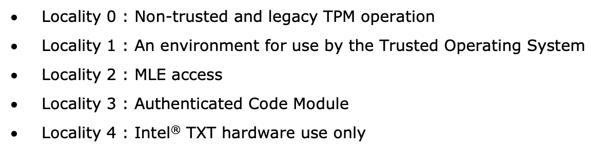
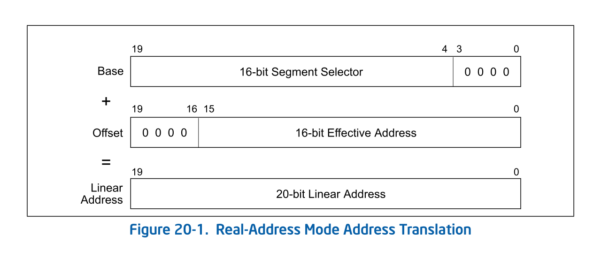
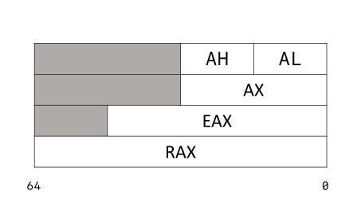
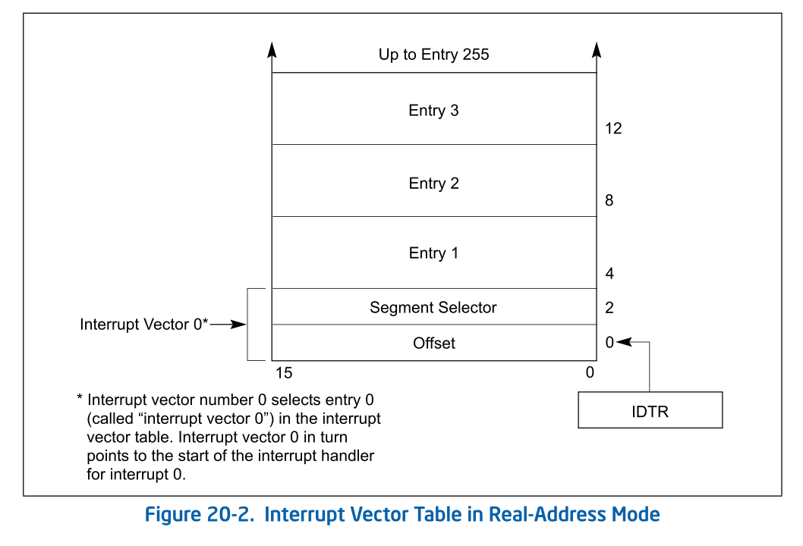
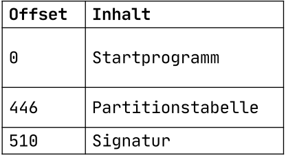
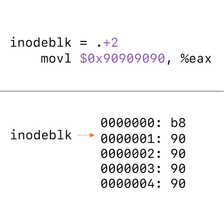
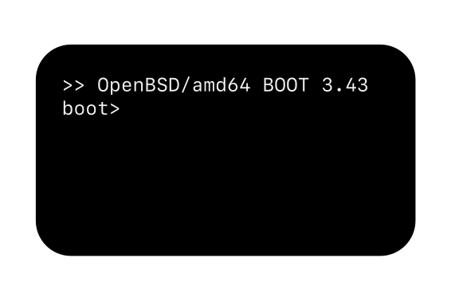

Fundamentals
++++++++++++
The foundations of this work begin with a theoretical section. This section
first describes an Evil Maid Attack and then presents concepts for mitigating
such an attack. The TPM, Intel Trusted Execution Technology (Intel TXT), and AMD
Secure Virtual Machine (SVM) are essential hardware components for implementing
countermeasures. The software leverages these hardware features to establish a
secure boot environment. This work explains each relevant component, from the
lower levels where the firmware resides to the higher levels where the operating
system runs.

A basic understanding of asymmetric cryptography is assumed. Knowledge in
low-level programming with assembler and familiarity with the x86-64 processor
platform are also helpful.

Evil Maid Attack
================
Attacks can be classified as either **opportunistic** or **targeted**. In
opportunistic attacks, the attacker is not familiar with the victim. They simply
exploit opportunities that arise by chance. The following example illustrates an
opportunistic attack: after paying, a customer forgets their laptop in a café.
An attacker who is also in the café notices this and extracts confidential data
from the system. In contrast, a targeted attack involves minimizing the number
of factors dependent on chance. The attacker gathers as much information about
the victim as possible and selects the most promising attack vector based on
this knowledge. The following example illustrates a targeted attack: Malory
seeks information from Bob’s laptop. She knows that Bob takes his laptop to a
café every Friday, goes to the restroom at least once, and does not lock his
laptop during this time. Malory plans to copy a confidential file from Bob’s
laptop within this window.

A successful Evil Maid Attack (EMA) requires detailed information about the
target system. Additionally, either repeated physical access or extended access
over time is necessary. Consequently, EMAs are considered targeted attacks.

Full Disk Encryption (FDE) protects the confidentiality of data in a system’s
powered-off state against attackers with physical access. However, FDE provides
no protection against malware that is executed after authentication to the
system has occurred. This also applies to unlocked systems that an attacker can
physically access [18]_. If most of the attack vectors are impossible, an
attacker might consider using an EMA to gain access to encrypted and
confidential data.

An Evil Maid Attack (EMA) may require either **one-time** or **repeated**
physical access to the hardware. With single access, an image of the hard drive
is created, and the bootloader is replaced with a manipulated version that
transmits the password, for example, over a connected network. If repeated
physical access is possible, it may be sufficient to store the password on the
hard drive. Generally, an attack with multiple access opportunities is easier to
execute. For a one-time access attack to be feasible, the key material must be
stored on the hard drive rather than on a USB stick or in a TPM. Additionally, a
significant amount of time is required to create a complete copy of the hard
drive without the victim noticing the attack.

Tampering can involve either **software** or **hardware** components. Examples
of hardware manipulation include attaching a USB keylogger [19]_, exfiltrating
data via a USB-based Man-in-the-Middle attack, or even creating a complete
duplicate of the target system. Software manipulation, on the other hand,
includes not only programs stored on the system’s hard drive but also firmware
held in the flash memory of integrated circuits (ICs). Additionally,
modifications to data processed by these programs may also count as software
tampering, especially if vulnerabilities like buffer overflows are used to
inject code into them.

Thus, the definition of an EMA for this work can be formulated as follows: In an
EMA, an attacker with single or repeated physical access manipulates the
hardware or software components of a target system protected by FDE to obtain
the authentication token of a specifically chosen victim. The victim must
successfully authenticate on the compromised system at least once.

An attack is **not** necessarily a security vulnerability. Whether an EMA is
considered a security vulnerability is determined by the security policy. For
laptops used exclusively within a corporate environment, it may be deemed
acceptable not to categorize this attack vector as a vulnerability. If an EMA is
considered a security vulnerability, then the security policy must define the
security objectives that an EMA would compromise. Confidentiality, Integrity,
and Availability (CIA) are the established security goals in Information
Technology (IT). When software or hardware is altered, integrity is compromised,
and in the case of a successful attack, confidentiality may also be affected. If
an EMA is classified as a security vulnerability, security measures should be
implemented to protect against this type of attack. This master’s thesis aims to
develop precisely such a security measure for OpenBSD, enabling detection of
software manipulations that remain unencrypted even with active FDE, before a
password entry is required. Detecting hardware or firmware manipulations is
initially out of scope and could be addressed in future research.

Countermeasures
---------------
Now that an EMA has been precisely defined, this chapter addresses theoretical
countermeasures. Established solutions are based on two distinct theoretical
approaches. Secure Boot detects software manipulation through cryptographic
signatures, while Qubes-AEM measures and logs the software being executed.
Starting with signatures, both approaches are examined and evaluated in detail
below.

Signatures
~~~~~~~~~~
Cryptographic signatures typically function through a combination of
cryptographically secure hash algorithms and asymmetric encryption methods, such
as Rivest–Shamir–Adleman (RSA). An executable file is reduced, for example, to a
20-byte value using SHA-1. This value is then encrypted with the private portion
of the key material and appended to the file as a signature. Third parties can
generate the hash value independently and compare it to the decrypted signature.
If both match, it can be concluded that no tampering has occurred. [23]_

Secure Boot is a process defined in the UEFI specification that validates the
signatures of software executed by the firmware. When Secure Boot is enabled,
any software in the boot chain without a valid signature will cause the boot
process to fail. The process begins with a Root of Trust and establishes a chain
of trust, where each program verifies the signature of the next. Computers with
the "Compatible with Windows" logo are required to include Microsoft's digital
keys and ship with Secure Boot enabled by default. Alternative operating
systems, such as Fedora and Ubuntu, are also compatible with Secure Boot. If an
operating system or boot software lacks a valid signature, users can self-sign
it and register the corresponding key in the (UEFI). [28]_

Secure Boot represents a significant improvement over systems that lack any
security mechanisms. However, it is not sufficient for ensuring a fully secure
boot process, as it does not account for the data used by the programs. Buffer
overflow vulnerabilities, for instance, can allow attackers to alter the control
flow and execute malicious code. Signature-based approaches are unable to detect
such exploits, leaving this as a critical security gap.

The measurement of components, which will be explained in more detail in the
next section, enables the detection of modifications to programs and the data
they use.

Measurements
~~~~~~~~~~~~
Measurement refers to the process of recording both executed software and the
data it processes. Instead of storing full copies of the software, the protocol
relies cryptographically secure hash function to conserve storage. The integrity
and reliability of these hash values are directly tied to the cryptographic
strength of the hash function used. Assuming the use of a secure hash function,
it becomes computationally infeasible to generate a malicious copy that produces
an identical hash. The measurement log can be queried by software to assess
whether the system state has deviated from a previously known and verified
configuration.

To address the trust evaluation question in practice, it is essential to
carefully determine which software measurements should be considered for this
purpose. If too many measurements are included, the system could not be trusted
after each boot, as certain data—such as the OptionROMs stored in the Basic
Input Output System (BIOS)—can vary from one boot to the next [60]_. Striking
an appropriate balance between security and practical usability is therefore
crucial. This involves selecting measurements that are critical to the integrity
of the system while minimizing variability that could undermine trust without
reason.

As with cryptographic signatures, measurement-based approaches also require a
Root of Trust, which must itself be inherently trustworthy. In the TPM
specification, this is referred to as the **Root of Trust for Measurement**
(RTM). The RTM's sole responsibility is to measure the next program in the
execution chain. Beyond this task, it does not perform any additional functions,
ensuring a clear and focused role in establishing the trustworthiness of
subsequent components.

In addition to the Root of Trust, the method by which the measurement log is
maintained is a critical consideration. Foremost, it must be ensured that the
log cannot be modified retroactively. This requirement excludes most types of
storage available in modern systems. On the amd64 platform, for instance, only
certain processor registers that can be written to once per boot cycle or
Read-Only Memory meet this criterion. However, these options are insufficient
for broader use, necessitating dedicated hardware that provides tamper-resistant
storage.

Equally important is ensuring the integrity of the log and that the results of
any log queries cannot be falsified. Addressing these challenges is the focus of
the Trusted Computing Group (TCG), which developed the Trusted Platform Module
(TPM) as a solution. The TPM, along with its features and functionality, is
introduced in the following chapter on foundational concepts.

Hardware
================
This chapter delves into the hardware components essential for understanding
this work, covering the fundamentals of the Trusted Platform Module (TPM),
various approaches to the Root of Trust for Measurement (RTM), and relevant
processor extensions. The TPM is an independent System on a Chip (SoC), designed
to provide secure cryptographic operations and measurement capabilities. In
contrast, Intel Trusted Execution Technology (Intel TXT) and AMD Secure Virtual
Machine (SVM) represent extensions of the i386 and amd64 Instruction Set
Architectures (ISA), respectively, and are utilized to implement a Dynamic Root
of Trust for Measurement (DRTM).

Trusted Platform Module
-----------------------
A secure implementation of measured software is not possible without hardware, a
fact recognized by the Trusted Computing Group (TCG), which led to the
development of the TPM specification. This thesis utilizes the Trusted Platform
Module (TPM) described within the specification for both measuring software
components and encrypting/decrypting secrets.

The Trusted Platform Module (TPM) refers not only to the specification but also
to the corresponding System on a Chip (SoC). This passive cryptographic
co-processor provides several functions designed to enhance the security of
systems. The first widely adopted version, TPM 1.1b, was released in 2003. This
was followed by version 1.2 in 2005, which introduced better protection against
dictionary attacks, a standardized API/SoC pin layout, and Direct Anonymous
Attestation (DAA). In 2014, the latest version, TPM 2.0, was released, offering
additional enhancements, including greater flexibility in the selection of
supported algorithms [29]_ (chap. 1) . For the purposes of this thesis, only
version 1.2 will be used to minimize the number of variables involved.

TPM-Owner und Storage Root Key
~~~~~~~~~~~~~~~~~~~~~~~~~~~~~~
When the TPM is in its factory state, a TPM Owner must be set in order to
utilize its full functionality. To do this, a secret is transferred into the
TPM, which will later serve to authenticate the owner. For the TPM, the secret
is a 20-byte array. Users are free to choose how the content of this secret is
generated [30]_ (chap. 7).

To keep the manufacturing costs of a TPM as low as possible, the specification
requires only a minimal amount of internal non-volatile memory. To still enable
the creation of a variety of different keys, whose private parts are never
accessible outside the TPM, a hierarchy is established, with the Storage Root
Key (SRK) at the root. During the initialization of the TPM, this key is set to
a random value. Similar to the TPM Owner, a secret must also be established for
the SRK. This secret is referred to as the SRK password.

The tpm-tools allow the execution of many TPM commands from the command line. On
Fedora, they can be installed using the command ``sudo dnf install tpm-tools``.
After installation, it is possible to set oneself as the owner of a TPM using
the command ``tpm_takeownership``. For further details, the third section of the
TPM specification in Chapter 6.1 can be consulted, which provides a detailed
description of the parameters of the ``tpm_takeownership`` command.

Platform Control Registers
~~~~~~~~~~~~~~~~~~~~~~~~~~
A Platform Control Register (PCR) is a 160-bit protected storage area within the
TPM. In TPM 1.2, there are at least 16 PCRs, which can store an arbitrary number
of integrity measurement values by chaining them through the extend
operation [30]_ (chap. 4.4).

After a platform reset, the contents of the Platform Control Registers (PCRs)
are reset to zero and can subsequently only be modified through the ``extend``
operation. Let *H* represent the cryptographic hash function ``SHA-1``,
*PCRi* denote the content of the PCR register with index *i*, and *E* be
the SHA-1 value of the measured data. The extend operation is defined as
follows [30] (chap. 4.4):

.. math::

   PCRi = H(PCRi || E)

In addition to these fundamental properties, the TPM PC Client Specification
[34]_ also recommends which integrity measurement values should be stored in
which PCRs. :numref:`pcr-usage` shows the details.

.. table:: PCR Usage
   :name: pcr-usage

   =========== ==========================================================
   PCR Index   PCR Usage
   =========== ==========================================================
    0          S-CRTM, BIOS, Host Platform Extensions, and Option ROMs
    1          Host Platform Configuration
    2          Option ROM Code
    3          Option ROM Configuration and Data
    4          IPL Code (usually the MBR) and Boot Attempts
    5          IPL Code Configuration and Data (for use by the IPL Code)
    6          State Transitions and Wake Events
    7          Host Platform Manufacturer Specific
    8-1        Defined for use by the Static OS
    16         Debug
    23         Application Support
   =========== ==========================================================

``PCR-08`` to ``PCR-15`` are reserved for use by the operating system.
Therefore, if OpenBSD wishes to measure its own software components, these PCRs
are available for this purpose.

The values in the PCRs can not only be queried but also set as conditions for
decrypting data. This type of encryption, referred to by the TCG as Sealing and
Unsealing, is explained in the following section.

Sealing and Unsealing
~~~~~~~~~~~~~~~~~~~~~
Sealing refers to the process of encrypting data using a TPM. The resulting
ciphertext can only be decrypted by the same TPM because the specified key must
be non-migratable. In other words, the private part of the key, by definition,
never leaves the TPM [32]_ (chap. 10.1). In addition to the key handle, PCR
indexes can also be specified. This means that the TPM will only decrypt the
data if the contents of the PCRs match the values they had when the data was
originally sealed. The following information is required when invoking the
``tpm_seal`` command:

1. Key: The Key Handle pointing to a non-migratable key. According to the
   specification, Key Handles are 32-bit integers, and integral keys such as the
   Storage Root Key (SRK) have a fixed value. For the SRK, this value is
   ``0x40000000``.

2. KeyAuth: When using a key, the TPM requires proof that the invoking party is
   authorized to do so. Authorized individuals are those in possession of the
   shared secret associated with the key. This shared secret is a 20-byte array,
   which is not transmitted directly but instead used as a key in an HMAC
   (Hash-based Message Authentication Code) algorithm.

3. Data: The data to be encrypted, which can be up to 256 bytes in size. If the
   data exceeds this size, a symmetric key must be used as an intermediate step.

4. DataAuth: Authorization data that must be provided to prove knowledge when
   calling the tpm_unseal command. This data is encrypted and transmitted
   securely over the Low Pin Count (LPC) bus to ensure confidentiality.

5. PCR Indexes: The PCR indexes whose contents are tied to the decryption
   process, such as ``PCR-01``, ``PCR-02``, ``PCR-03``.

The result of the Seal operation is a data stream that contains all the
necessary information for the TPM to later decrypt the data. This includes the
contents of the PCR at the time of encryption. These and additional data must be
provided when executing ``tpm_unseal``.

1. Key: The same as for ``tpm_seal``.

2. KeyAuth: The same as for ``tpm_seal``.

3. Data: The response form ``tpm_seal``.

4. DataAuth: The same as for ``tmp_seal``.

Root of Trust for Measurement
~~~~~~~~~~~~~~~~~~~~~~~~~~~~~
The TPM is a passive component that does not directly influence which software
runs on a system. To ensure that the executed software and the contents of the
PCR are consistent, a Chain of Trust is employed, in so overcoming the
limitation of not being in control.

Starting from a Root of Trust, or in the context of measurements, a Root of
Trust for Measurement (RTM), each executed software component is measured by its
predecessor. The RTM is unique because it has no predecessor and is therefore
implicitly trusted. Consequently, any manipulation of the RTM must be rendered
impossible. In the TPM specification, the RTM is also referred to as the Core
Root of Trust for Measurement (CRTM).

In a system employing a **Static Root of Trust for Measurement** (S-RTM), the
CRTM must not only remain immutable but also execute as early as possible during
platform initialization. The following excerpt from the specification defines
the key properties of the S-CRTM:

    The Static Core Root of Trust for Measurement (S-CRTM) MUST be an
    immutable portion of the Host Platform’s initialization code. See Section
    1.2.2 (Immutable). [30] (chap. 3.3.1.2)

The entries in the PCR content table (Table 2.1) illustrate the Chain of Trust
within a system utilizing a Static Root of Trust for Measurement (SRTM). Since
the CRTM is implicitly trusted, it measures itself, the BIOS, the Host Platform
Extensions, and the Embedded Option ROMs. The resulting measurement values are
stored in PCR-00, PCR-01, PCR-02, and PCR-03, respectively.

The CRTM subsequently hands over control to the BIOS, which then measures the
Initial Program Loader (IPL) code. In IBM XT2-compatible systems, this
corresponds to the Master Boot Record (MBR). The MBR can return control to the
BIOS if issues arise. If an additional IPL is available, PCR-04 is extended
again, thereby capturing all boot attempts within its cumulative measurement.

The more programs that gain control of the system during startup, the higher the
likelihood that the system's trustworthiness will be compromised. This is
because updates to individual components, even when made with no malicious
intent, can alter the contents of the PCRs [38]_ (chap. 1.2).

Dynamic Root of Trust for Measurement (DRTM) provides a solution to this
challenge. This approach allows for the initiation of a measured environment at
any arbitrary point in time. To facilitate this, PCRs that can be reset were
introduced. The reset operation is restricted to specific entities through
different privilege levels, referred to in the TPM specification as Localities.
:numref:`pcr-attributes` provides a detailed overview of which PCRs can be reset
and the required Locality level for performing this operation.

.. table:: PCR Attributes
   :name: pcr-attributes

   ========== ====================== ======== ============================= ==============================
   PCR Index  Alias                  pcrReset pcrResetLocal (4, 3, 2, 1, 0) pcrExtendLocal (4, 3 ,2, 1, 0)
   ========== ====================== ======== ============================= ==============================
   0 – 15     Static RTM             0        0,0,0,0,0                     1,1,1,1,1
   16         Debug                  1        1,1,1,1,1                     1,1,1,1,1
   17         Locality 4             1        1,0,0,0,0                     1,1,1,0,0
   18         Locality 3             1        1,0,0,0,0                     1,1,1,0,0
   19         Locality 2             1        1,0,0,0,0                     0,1,1,0,0
   20         Locality 1             1        1,0,1,0,0                     0,1,1,1,0
   21         Dynamic OS Controlled  1        0,0,1,0,0                     0,0,1,0,0
   22         Dynamic OS Controlled  1        0,0,1,0,0                     0,0,1,0,0
   23         Application Specific   1        1,1,1,1,1                     1,1,1,1,1
   ========== ====================== ======== ============================= ==============================

It is the platform's responsibility to ensure that Localities cannot be spoofed.
Specifically, Locality 4 can only originate from the CPU itself, necessitating
additional processor features. Both Advanced Micro Devices (AMD) and Intel
provide extensions that enable DRTM in conjunction with a TPM. These extensions
are briefly described in the following sections.

Intel Trusted Execution Technology
----------------------------------
Intel Trusted Execution Technology (TXT) is Intel's branding for a suite of
technologies designed to enhance the security of existing computer systems. It
outlines platform enhancements and building blocks essential for implementing
Trusted Computing principles [38]_ (chap. 1).

As previously outlined, Intel TXT enables the initiation of a Chain of Trust
with a dynamic origin. This approach offers the advantage of maintaining a
shorter chain, reducing the number of components involved and thus minimizing
the number of components required to be trustworthy.

The newly introduced processor instruction SENTER enables the launch of a
Measured Launch Environment (MLE). This instruction first synchronizes all
processor cores and then executes the **Authenticated Code Module** (ACM) on the
**Initiating Logical Processor** (ILP), provided the ACM carries a valid
signature from Intel. Prior to invoking the instruction, both the ACM and the
MLE must be loaded into memory to ensure proper execution [38]_ (chap. 1.2.1).

The Authenticated Code Module (ACM) verifies the state of the Central Processing
Unit (CPU). If the configuration is deemed satisfactory, it resets PCRs 17–23.
Subsequently, the ACM measures itself and the Measured Launch Environment (MLE)
into PCR-17, after which control of the system is handed over to the MLE [38]_
(chap. 1.1–1.9).

:numref:`txt-localities` illustrates how Intel utilizes the four
localities defined in the TPM specification. When analyzed alongside Table 2.2,
it becomes evident which combinations of software components and PCRs are
authorized to perform either the Reset or Extend operations.

   TXT Localities

With Intel TXT and resettable PCRs, it is possible to launch an MLE at any
desired point in time. For further details, refer to Intel's Software
Development Guide [38]_, the book A Practical Guide to TPM 2.0 [29]_ (chap. 22),
or the book *Intel Trusted Execution Technology for Server Platforms*.

AMD Secure Virtual Machine
--------------------------
In addition to Intel, AMD also provides the capability to initiate a trusted
environment at runtime through its Secure Virtual Machine technology. If
supported by the CPU, this can be achieved by executing the SKINIT instruction.

The SKINIT instruction requires a single parameter in the eax register, which is
the address of a Secure Loader Block (SLB). This SLB is AMD's term for the
memory region containing the Secure Loader Image (SLI). The SLI includes both
the code and initialized data for the Secure Loader (SL) program. The SL is
responsible for initializing the Secure Virtual Machine (SVM) hardware
mechanisms and transferring control to the next software component, referred to
by AMD as the Security Kernel. In practical applications, this Security Kernel
is often a Virtual Machine Monitor (VMM) [52]_ (chap. 2.4) [36]_ (chap. 15.27).

Before the first instruction of the Secure Loader (SL) program is executed, the
SKINIT instruction initializes the processor to a well-defined state. In this
state, modifications to the Secure Loader Image (SLI) are prevented.
Additionally, interrupts are disabled, ensuring that no previously executed code
can regain control of the system. This guarantees a secure and isolated
execution environment for the SL program [36]_ (chap. 15.27).

Once all hardware protection mechanisms are activated, the CPU sends a signal to
reset the dynamic PCRs to the TPM. Following this, the processor transmits the
Secure Loader Image (SLI) to the TPM, which computes a cryptographic hash of the
received data and extends ``PCR-17`` with the resulting value. This coordinated
interaction between hardware and software establishes a Root of Trust that
serves as the foundation for further extensions within the trust chain.

The book *Trust Extension as a Mechanism for Secure Code Execution on Commodity
Computers* [52]_ provides a highly accessible explanation of AMD SVM and Intel
TXT in Chapter 2.4. For more detailed information on AMD's technology, the
second volume of the AMD64 Architecture Manual [36]_, specifically Section 15.2,
offers an in-depth exploration.

With this, the foundational knowledge regarding hardware is complete. The
sections on Intel TXT and AMD SVM have been kept intentionally brief, as neither
technology is utilized in the implementation. The following chapter will focus
on the software components, spanning from firmware to the operating system, that
are executed during the startup of OpenBSD on an IBM XT-compatible system.

Firmware
========
After a platform reset of an i386 or amd64 CPU, the processor enters real mode
with only a single core active. The Extended Instruction Pointer (EIP) register
is set to the address ``FFFF:FFF0``, known as the reset vector [35]_ (chap.
8.4.3). At this address resides the system firmware, which, in the case of the
test system used in this work, implements UEFI.

The responsibilities of firmware include performing the Power-On Self Test
(POST), during which the installed hardware is checked for functionality, and
booting an operating system through chainloading. Essential hardware components,
such as the keyboard, display, and storage devices, are initialized by the
firmware and made operational. These components are then exposed to subsequent
software via an Application Programming Interface (API) [39]_ (chap. 1). Both
the unofficial BIOS standard and the official UEFI standard define such APIs,
which will be introduced in the following sections.

Unified Extensible Firmware Interface
-------------------------------------
On January 31, 2006, the first version of the UEFI specification was published.
Its goal, as well as that of its predecessor, the Extensible Firmware Interface
(EFI) developed by Intel, was to reduce platform dependency in firmware [40]_.
Leveraging the opportunity for a fresh start, numerous additional improvements
were introduced alongside this primary objective. These enhancements include
support for GUID Partition Table (GPT), 64-bit firmware code, and security
features such as Secure Boot.

Although UEFI is already widely adopted and is poised to play an even more
significant role in firmware in the future, this work opted to enable the
Compatibility Support Module (CSM). The CSM emulates a legacy BIOS, allowing for
the traditional boot process of an operating system [41]_. This decision was
made for the following reasons:

1. Existing software solutions such as TrustedGRUB2 or the AEM module in QubesOS
   are designed to work with legacy BIOS. Using legacy BIOS is advantageous for
   enabling later comparisons, exploring potential compositional solutions, or
   drawing inspiration for developing a custom solution.

2. UEFI firmware is more portable and offers a greater range of features
   compared to traditional firmware. However, this increased complexity demands
   additional time for familiarization, which could detract from the time
   available to address the primary problem.

Basic Input Output System
-------------------------
The BIOS firmware is tightly integrated with the platform for which it was
originally designed: the 8/16-bit Intel 8088 microprocessor, introduced in
1981 [39]_ (chap. 1). At the time, many functionalities provided by this chip
were utilized without abstraction, as the future trajectory of the personal
computer (PC) market was still unpredictable. Due to the relatively small number
of computers and companies developing firmware for them, there was no pressing
need for an official specification. BIOS firmware from companies like American
Megatrends and Phoenix became the most widely used, and despite minor
differences, they remain largely compatible with each other.

Before delving into the specifics of the BIOS API, the following section
describes the state of the processor immediately after a PC starts. The
information is based on the Intel® 64 and IA-32 Architectures Software
Developer’s Manual [35]_ and applies to both i386 and amd64 CPUs.

Real Address Mode
~~~~~~~~~~~~~~~~~
The execution environment, referred to in modern Intel processors as
*Real-Address Mode*, emulates that of the 8086 processor introduced in 1990.
When a processor begins executing instructions, either following a reset or
during system startup, it operates in this mode. The key characteristics of this
execution environment are outlined below.

Memory Addressing in Real-Address Mode
^^^^^^^^^^^^^^^^^^^^^^^^^^^^^^^^^^^^^^
In the physical address space of an 8086 processor, up to 1
MiB of memory can be addressed. The physical address corresponds directly to the
linear address, which is computed from the 16-bit Segment Selector and the
16-bit Effective Address. To generate a 20-bit linear address from these two
16-bit values, the Segment Selector is shifted 4 bits to the left and then added
to the Effective Address.

This process is illustrated in :numref:`segment-addressing`, which provides a visual
representation of this address construction mechanism. It is important to note
that some linear addresses can result from multiple combinations of Segment
Selector and Effective Address. For instance, the linear address 10000 can be
generated in several ways using this addressing scheme.

.. math::

    Li = Se + Of

    0b10000 = 0b00000 + 0b10000

    0b10000 = 0b00001 + 0b00000

   Memory Addressing with Segments [35]_

Instructions and Registers
^^^^^^^^^^^^^^^^^^^^^^^^^^
This section is not a comprehensive reference of all instructions but rather a
brief explanation of how certain instructions implicitly utilize registers and
their contents. It highlights how specific operations rely on predefined
registers to function, even without explicitly referencing them in the
instruction syntax.

In Real-Address Mode, programs have access to eight general-purpose 16-bit
registers: **AX**, **BX**, **CX**, **DX**, **SP**, **BP**, **SI**, and **DI**.
In the emulated environment, their 32-bit extensions, prefixed with E (e.g.,
**EAX**, **EBX**), can also be utilized.

In addition to these general-purpose registers, there are four segment
registers: **CS**, **DS**, **SS**, and **ES**. Each serves a specific function,
with CS (Code Segment) being used as the segment selector for the code segment.
These names are mnemonics, providing descriptive identifiers for their roles.
They can be referenced or looked up for clarification when necessary.

The ``loop`` instruction is an example of a command whose behavior depends on the
contents of a register. If the CX register contains a value greater than 0, the
instruction decrements CX and jumps to the address specified in its operand. If
CX equals 0, the jump is not performed, and execution continues with the
instruction following the ``loop`` command.

   Intel Registers

As illustrated in :numref:`intel-registers`, **AX** and **EAX** are not distinct
registers but rather represent the same register with different sizes. This
implies that writing to RAX simultaneously modifies the contents of **EAX**,
**AX**, **AH**, and **AL**, as these smaller segments are subsets of the larger
register.

Interrupts
^^^^^^^^^^
A CPU executes instructions in the sequence predefined by a program. However,
interrupts allow this sequence to be temporarily disrupted, enabling the
execution of other instructions before resuming the interrupted program.

    To understand the BIOS architecture, one must consider the interrupt-driven
    nature of the Intel 80x86 architecture [39]_ (chap. 1).

This statement aptly describes the 8086 CPU as interrupt-driven. Interrupts can
be triggered by hardware components within the system, by the CPU itself, or by
software [39]_ (chap. 1). Software interrupts, in particular, are of interest for
this work as they enable invoking BIOS services.

A software interrupt is triggered using the assembly instruction ``int 0x1a;``.
This instruction consists of the ``int`` mnemonic (short for "interrupt") and
the operand 0x1a, which is referred to as the interrupt vector. The CPU uses
this vector to determine the offset in the **Interrupt Vector Table (IVT)**,
where the corresponding interrupt service routine is located.

:numref:`interrupt-vector-table` illustrates the structure of the Interrupt
Vector Table (IVT). It starts at the physical address 0x0000 and consists of 255
pointer entries, each occupying 4 bytes. Each pointer is composed of 2 bytes for
a segment selector and 2 bytes for an offset, allowing an interrupt handler to
be located anywhere within the address space.

While the software has the flexibility to define the pointers in this table, the
number of interrupt vectors is fixed. Of these, only the vectors 32 to 255 are
available for software use. The others are reserved by Intel for predefined
purposes, such as Interrupt 0, which is triggered by a division-by-zero
exception.

   Interrupt Vektor Table [35]_

BIOS API
^^^^^^^^
Understanding software interrupts makes it straightforward to explain how BIOS
functionality can be invoked. During initialization, the BIOS populates the
Interrupt Vector Table (IVT) with specific function pointers. By triggering a
software interrupt, the corresponding function pointer in the IVT is executed,
enabling the desired BIOS routine to run.

To maintain logical organization and because 255 entries in the Interrupt Vector
Table (IVT) are relatively limited, the interrupt vector primarily serves as a
preselection mechanism for device categories. For instance, interrupt vector
``0x10`` is designated for video services [39]_ (chap. 1).

The selection of which routine within the specified category to execute is
determined by the value in the AL register. Additional parameters are passed to
the routine using other registers. The following assembly code demonstrates how
to invoke a BIOS routine to set the cursor position [39]_:

.. code-block:: asm
   :caption: Set Cursor Position via BIOS
   :linenos:
   :name: set-cursor-bios

    MOV AH, 2       ;Select "Set Cursor Position" function
    MOV DH, 3       ;Input row parameter into DH register
    MOV DL, 14      ;Input column parameter into DL register
    INT 10H         ;Invoke INT 10h, BIOS Video Service

:numref:`set-cursor-bios` concludes the firmware chapter, addressing the
following questions:

1. What is the role of firmware in PCs?

2. In what state is the CPU immediately after startup, and what features does it
   offer?

3. How can the functionality provided by the BIOS be executed?

The following chapter explains which software component takes control from the
firmware and how the OpenBSD operating system is loaded.

OpenBSD
-------
The OpenBSD operating system was initiated in 1995 by Theo de Raadt as a fork of
NetBSD. Its entire source code is publicly available and distributed under the
BSD license or an even more permissive variant. The project emphasizes
portability, standardization, correctness, proactive security, and integrated
cryptography. These objectives, particularly proactive security, distinguish
OpenBSD from all other operating systems. With a strong focus on security,
OpenBSD is suitable for deployment as a router, server, firewall, or desktop
system.

The accompanying USB stick provided with this work contains a dd dump of a hard
drive where OpenBSD with Full Disk Encryption (FDE) has been installed. The
first 100 megabytes were zeroed out prior to the installation to facilitate
better understanding when inspecting the disk. Additionally, reference sections
for all OpenBSD tools are included in parentheses. OpenBSD's documentation is
excellent and can be consulted for further information.

The following sections will cover the fundamentals of all software components
executed during the startup process of OpenBSD on an amd64 platform. The Master
Boot Record (MBR), introduced with the IBM PC XT in 1983, remains in use on many
systems to this day. It is directly loaded and executed by the BIOS, making it
the first software component to run after the firmware.

Master Boot Record
~~~~~~~~~~~~~~~~~~
The Master Boot Record (MBR) is located at the Cylinder Head Sector (CHS)
address (0, 0, 1) or at Block 0 when Logical Block Addressing (LBA) is used. It
occupies a single sector and has a maximum size of 512 bytes on hard drives.

There is no formal standard defining the Master Boot Record (MBR). The following
information is derived from the OpenBSD source code [12]_
(``sys/sys/disklabel.h``).

   MBR Contents

As illustrated in :numref:`mbr-contents`, the Master Boot Record (MBR) for
OpenBSD consists of three parts. The first 440 bytes are occupied by the
bootloader. Its primary task is to search the subsequent partition table for an
active partition and load and execute the Partition Boot Record (PBR) from that
partition. The corresponding source code can be found in the file [12]_
(``sys/arch/amd64/stand/mbr/mbr.S``)

The partition table provides space for information on exactly four partitions. A
standard OpenBSD installation requires only one, as additional partitions are
defined using disklabels. The last two bytes of the MBR contain the signature
``0x55 0xaa``.

The first sector of a partition contains the Partition Boot Record (PBR). This
sector holds the ``biosboot`` program, which will be introduced in the next
section.

biosboot(8)
~~~~~~~~~~~
The sole purpose of the ``biosboot(8)`` program is to load the second-stage
bootloader ``boot(8)``. As with the MBR, the PBR is also restricted to a maximum
size of 512 bytes.

To load ``boot(8)``, ``biosboot(8)`` first requires information about the
location and size of the program on the disk. At this stage, a fully functional
file system cannot be utilized due to the size constraints of ``biosboot(8)``.
OpenBSD employs the standard Unix inode system to manage file metadata. Since
``biosboot(8)`` is capable of interpreting the inode data structure, it only
needs the location of the inode corresponding to boot to proceed.

This information, along with other necessary details, is embedded directly into
the program code during the installation of ``biosboot(8)`` by the
``installboot(8)`` utility. In the source code file
``sys/arch/amd64/stand/biosboot/biosboot.S``, the label inodeblk references the
immediate value of a mov instruction, indicating the location of it.

Figure :numref:`biosboot-patch` illustrates the exact implementation of this
process. The first two lines represent assembly code, followed by the resulting
bytecode. The ``movl`` instruction is translated by the assembler into the
opcode b8, which instructs the processor to load the four bytes following the
command into the ``eax`` register. The label inodeblk points directly to the
start of these four bytes, and this label is utilized by ``installboot(8)`` to
insert the inode's block address at this location.

   biosboot patch

After the successful execution of ``biosboot(8)``, the second-stage bootloader
``boot(8)``, which is the first program in this sequence that can exceed 512
bytes in size, is loaded into memory and executed via a ``ljmp`` instruction.

boot(8)
~~~~~~~
``boot(8)``, also known as the second-stage bootloader, is responsible for
loading the operating system kernel into memory, decompressing it, and
transferring control to it.

Unlike its two predecessors, boot(8) introduces the ability to interact with the
boot process. This interaction can occur either by entering commands in the
interactive console, as shown in :numref:`bootprompt`, or via the configuration
file /etc/boot.conf. The configuration file serves to automate commands,
offering the same range of possibilities as the interactive input.

   boot(8) prompt

In addition to the eight universally available commands—such as boot(8), echo,
or set—the amd64 platform includes machine-specific commands. These commands are
prefixed with machine and followed by their respective names, such as diskinfo,
which outputs information about all hard drives detected by the BIOS to the
console.

The BIOS leaves the processor unchanged in real mode, where only 20 bits are
available for memory addressing. This allows for a maximum of 1 MiB of
addressable memory. Since the OpenBSD kernel requires approximately 15 MiB of
memory, boot(8) must transition the processor to protected mode.

This detail is significant because invoking BIOS routines necessitates switching
the processor back to real mode. For example, loading data from the hard disk is
performed through such BIOS calls.

On the hard disk, boot, like all other system files, exists as a regular file
within the Fast File System (FFS). However, in the case of active Full Disk
Encryption (FDE), this file system is encrypted. The following section explains
how FDE is enabled in OpenBSD and from where biosboot retrieves boot in such
scenarios.

Full Disk Encryption
~~~~~~~~~~~~~~~~~~~~
The OpenBSD installer does not provide a straightforward yes/no option to enable
Full Disk Encryption (FDE). However, this does not mean the functionality is
unavailable. OpenBSD supports FDE using AES-256 in XTS mode. To configure this,
it is necessary to interrupt the installation process by pressing ``Ctrl-C`` to
access the shell before selecting the installation target. Then, the commands
listed in Listing 2.2 must be executed.

.. code-block:: bash
   :caption: OpenBSD install with FDE
   :linenos:
   :name: open-bsd-fde

    $ dd if=/dev/zero of=/dev/rsd0c bs=512 count=1024
    $ fdisk -iy sd0
    $ disklabel -E sd0
    sd0> a a
    offset: [64]
    size: [39825135] *
    FS type: [4.2BSD] RAID
    sd0> w
    sd0> q
    $ bioctl -c C -l sd0a softraid0
    $ dd if=/dev/zero of=/dev/rsd2c bs=512 count=1024
    $ exit

1. This line uses the dd tool to overwrite the beginning of the hard drive with
   zeros. This ensures that programs like fdisk will not get confused by the
   random data, and additionally it is helpful for later analysis, to see which
   data was actually written.

2. This command initializes the partition table in the MBR. It creates a
   partition that starts at block address 64 (``0x8000``) and ends at the last
   possible block.

3. A disklabel is an OpenBSD-specific disk management structure located
   immediately after the PBR (Partition Boot Record) on the disk. It allows the
   disk to be divided into up to 15 partitions, which is the preferred method of
   partitioning in OpenBSD. Using the interactive editor ``disklabel(8)``, we
   define a single disklabel partition in lines 3 through 9. This partition
   mirrors the values of the partition recorded in the MBR. In OpenBSD, letters
   are used to identify individual partitions, and in this case, we have
   assigned the letter ``a`` to this partition.

10. This line registers a pseudo block device in OpenBSD, which implements the
    encryption transparently. To do this, the RAID management tool ``bioctl`` is
    used. Due to their technical similarity, full disk encryption (FDE) in
    OpenBSD is implemented as a RAID discipline. Here, we pass the partition
    ``sd0a`` created in the previous step and use the ``-c C`` flag to instruct
    ``bioctl`` to use the RAID discipline CRYPTO. After entering the password
    twice, the device ``sd2`` is created (when installing from a USB stick). All
    data written to this block device is automatically encrypted using AES.

11. Here, as in the first step, the beginning of our newly created pseudo-block
    device is overwritten with zeros. This step is particularly important for
    this device because the decryption of previously unencrypted data can result
    in high entropy values.

12. The installation is now continued with the exit command, and sd2 is selected
    as the target.

Both the ``MBR`` and the ``PBR`` remain unchanged, regardless of whether FDE
(Full Disk Encryption) is enabled or not. However, since ``boot(8)`` resides in
the regular file system, which is encrypted during the installation with FDE,
the question arises as to how exactly ``biosboot(8)`` handles this case.

.. table:: FDE Partitions
   :name: fde-partitions

   ========== ====================== ========
   Offset     Content                Size
   ========== ====================== ========
   0x08000    Partition Boot Record  512
   0x08200    Disklabel              500
   0x0a000    Softraid Metadata      8192
   0x12000    /boot                  x
   ========== ====================== ========

The CRYPTO discipline is exclusively offered by the OpenBSD software RAID driver
``softraid(4)``. In parts of its source code [12]_ (``sys/dev/softraidvar.h``,
``sys/arch/amd64/stand/libsa/softraid_amd64.c``), the implementation details of
the CRYPTO discipline are more clearly visible. The ``softraid(4)`` driver
stores **unencrypted** metadata in a defined area on the disk, which includes
securely stored key material.

The preprocessor directives ``SR_META_OFFSET`` and ``SR_META_SIZE`` define the
exact location of this data. In addition to these two values, their sum is
referred to as ``SR_BOOT_OFFSET``, at which the ELF signature of ``boot(8)`` can
be found on the disk. Table :numref:`fde-partitions` shows the exact offset
values and their contents.

This provides an overview of how OpenBSD starts on an amd64 system and which
components remain unencrypted even when Full Disk Encryption (FDE) is enabled.
The boot process begins with the ``MBR``, followed by the ``PBR``, and finally a
copy of ``boot(8)`` in the ``softraid(4)`` metadata. The operating system
kernel, however, is encrypted, which is particularly useful for this work, as
OpenBSD's kernel relinking feature ensures that the kernel is different with
each boot.

Here is a short summary of what this chapter has explained:

1. Explanation and definition of an Evil Maid style attack.

2. Theoretical solutions for detecting them.

3. What hardware is required to realise those solutions.

4. Which software components are left unencrypted even with a FDE OpenBSD
   system.

5. Invoking firmware provided functionality.

In the following, a State-of-the-Art analysis will first evaluate two practical
implementations with other operating systems, followed by a practical
implementation for OpenBSD.

.. [12] OpenBSD 6.5 Source Code 01/2019

.. [18] Johannes Götzfried Trusted Systems in Untrusted Environments: Protecting
   against Strong Attackers 12/2017

.. [19] David Kierznowski MSc, Keith Mayes ISG BadUSB 2.0: Exploring USB Man-In-
   The-Middle Attacks 05/2016

.. [23] B. Kaliski PKCS #1: RSA Encryption Version 1.5, RFC 2313 03/1998

.. [28] Hendrik Schwartke , Ralf Spenneberg UEFI-Secure-Boot und alternative
   Betriebs- systeme, ADMIN 03/2014

.. [29] Will Arthur, David Challener, Kenneth Goldman A Practical Guide to TPM
   2.0, 01/2015

.. [30] TPM Main Part 1 Design Principles, 03/2011 Version 1.2

.. [32] TPM Main Part 3 Commands, 03/2011 Version 1.2

.. [34] TCG PC Client Specific Implementation Specification for Conventional
   BIOS, 02/2012 Specification Version 1.21 Errata

.. [35] Intel® 64 and IA-32 Architectures Software Developer’s Manual, 09/2016
   Volume 3 (3A, 3B, 3C and 3D): System Programming Guide

.. [36] AMD64 Architecture Programmer’s Manual, 10/2019 Volume 2: System
   Programming

.. [38] Intel® Trusted Execution Technology (Intel® TXT), 11/2017 Measured
   Launched Environment Developer’s Guide

.. [39] Mike Boston Paul Narushoff System BIOS for IBM PC/XT/AT Computers and
   Compatibles, 09/1990 The Complete Guide to ROM-Based System Software

.. [40] Vincent Zimmer Michael Rothman Suresh Marisetty Beyond BIOS, 09/2013
   Developing with the Unified Extensible Firmware Interface

.. [41] Intel® Platform Innovation Framework for UEFI, 09/2013 Compatibility
   Support Module Specification

.. [52] Bryan Jeffrey Parno Trust Extension as a Mechanism for Secure Code
   Execution on Commodity Computers, 08/2016

.. [60] https://software.intel.com/en-us/forums/intel-trusted-execution-technology-intel-txt/topic/518519
