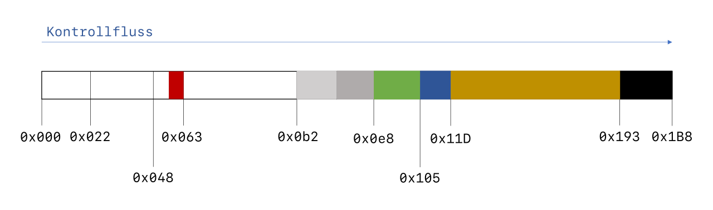

Implementation
++++++++++++++
With the accumulated knowledge about other systems and the resulting decision to
utilize OpenBSD's boot chain, a prototype was developed to meet the following
requirements:

1. The prototype must extend the Chain of Trust across all software components
   involved in the boot process. Specifically, this includes the MBR,
   ``biosboot(8)``, and ``boot(8)``. This fulfills the first part of the title
   of this work: *a measured boot environment.*

2. The prototype leverages this Chain of Trust to enable users to detect
   manipulations of the measured software components. This feature fulfills the
   second part of the title, *including AEM.*

3. The required code should be designed to integrate into OpenBSD. This implies
   it must be released under the BSD license and must not, under any
   circumstances, remove existing functionality.

The order of the requirements corresponds to the structure of the implementation
chapter. It begins with the extension of the startup program in the MBR to
ensure it propagates the Chain of Trust and concludes with the necessary
modifications to ``boot(8)`` for detecting EMAs.

MBR enhancements
================
The source code for the startup program in the MBR is located in the directory
``sys/arch/amd64/stand/mbr/``. It consists of the Makefile, required for
building, and the assembler file ``mbr.S``. Compiling is straightforward:
navigate to the directory and execute the ``make`` command. Once completed, the
file mbr, containing the machine code of the MBR, is generated in the same
directory.

In addition to the actual startup program, which occupies 440 bytes, the MBR
also contains the partition table and the signature ``0x55 0xAA`` at its very
end. The source code includes not only the startup program but also placeholders
for the partition table and signature. Consequently, the assembler generates a
complete MBR with an empty partition table, which can later be modified using
tools such as ``fdisk``. The output file ``mbr`` is exactly 512 bytes in size.
To ensure the partition table remains intact during updates, only the first 440
bytes should be overwritten.

The limited space in the MBR leaves little room for extensive communication with
the TPM. Recognizing this constraint, the Trusted Computing Group (TCG) has
defined an API specifically for such scenarios. This API consists of several
functions, of which only two are sufficient for our use case.

TCG BIOS API
------------
The ``TCG_StatusCheck`` function is used first to verify whether the firmware
provides a TCG-BIOS interface. This function is invoked using the assembly
instruction ``int 0x1A``. Before the call, the CPU must be prepared in the state
shown in :numref:`tcg-status-check-api`.

.. code-block::
   :caption: TCG Status check API [34]_
   :linenos:
   :name: tcg-status-check-api

    # On entry:
        %ah = 0xbb
        %al = 0x00

    # On return:
        %eax = Return code. Set to 00000000h if the system supports the TCG BIOS calls.
        %ebx = 0x41504354
        %ecx = Version and errata of the specification this BIOS supports.
               Bits 7-0 (CL): 0x02 (TCG BIOS Minor Version (02h for version 1.21))
               Bits 15-8 (CH): 0x01 (TCG BIOS Major Version (01h for version 1.21))
        %edx = BIOS TCG Feature Flags (None currently defined. MUST be set to 0)
        %esi = Absolute pointer to the beginning of the event log.
        %edi = is set to the absolute pointer to the first byte of the last event in the log

Thus, only the ah register needs to be set to the value ``0xBB``, and the al
register to ``0x00``, which can be accomplished with a single movw instruction.

The state after returning from the interrupt is also illustrated in
:numref:`tcg-status-check-api`. For the code in the MBR, the primary concern is
determining whether the firmware provides a TCG-BIOS interface. This can be
verified by checking if the content of the eax register is set to ``0x00``. To
ensure accuracy, the ``ebx`` register should also be checked for the value
``0x41504354``, which corresponds to the ASCII characters ``TCPA``. This
abbreviation stands for Trusted Computing Platform Alliance (TCPA).

If both registers hold the correct values, the BIOS provides the TCG interface,
and we can utilize it in the subsequent program flow. The objective is to
measure the Partition Boot Record (PBR) loaded by the MBR by determining its
SHA-1 hash value and extending a Platform Configuration Register (PCR) with it.
However, a standalone SHA-1 implementation already exceeds the 440-byte limit.
Therefore, the hash computation must be delegated to the firmware.

The function provided by the TCG for this task is named
``TCG_CompactHashLogExtendEvent``. Its lengthy name encapsulates all the tasks
it performs: calculating the ``SHA-1`` hash value of a given memory region,
extending the log, and updating a PCR with the computed hash value. This
function is particularly well-suited for space-constrained applications like the
MBR, where only the code for parameter placement and the interrupt invocation is
required.

.. code-block::
   :caption: TCG Compact Hash Log Extend API [34]_
   :linenos:
   :name: tcg-hash-log-extend

    On entry:
        %ah = 0xbb
        %al = 0x07
        %es = Segment portion of the pointer to the start of the data buffer to be hashed
        %di = Offset portion of the pointer to the start of the data buffer to be hashed
        %esi = The informative value to be placed into the event field
        %ebx = 0x41504354
        %ecx = The length, in bytes, of the buffer referenced by ES:DI
        %edx = The PCR number (PCRIndex) to which the hashed result is to be extended

    On return:
        %eax = Return Code as defined in Return Codes 10.2
        %edx = Event number of the event that was logged

:numref:`tcg-hash-log-extend` shows the prerequisites for invoking the
``TCG_CompactHashLogExtendEvent`` function, which is selected by setting the
value ``0xbb07`` in the ``eax`` register. The segment-offset address of the
memory region to be used is expected in the ``es`` and ``si`` registers, while
its size is specified in the ecx register. The ``ebx`` register contains the
ASCII string ``TCPA`` to protect against unintended invocations, edx holds the
index of the PCR register to be used, and esi contains an informational value
for the log. In this implementation, the esi value is consistently set to ``0``
for both calls and is not further utilized.

With these two functions provided by the TCG BIOS API, it is possible to extend
the Chain of Trust. Before invoking the ``TCG_CompactHashLogExtendEvent``
function, it is crucial to understand the exact memory location where the PBR
(Partition Boot Record) is loaded and where the control transfer to it occurs.

OpenBSD MBR
-----------
The MBR startup program scans the partition table for a partition marked as
active, loads the PBR (i.e., the first sector of the partition), and transfers
control to it. Figure 5.3 illustrates the OpenBSD MBR startup program divided
into several sections, with their functions described individually below.

All address and size information is derived from the disassembly of the MBR. An
annotated version of this disassembly (``mbr/mbr.orig.disass``) is included with
this work on the USB stick. The disassembly was generated using the command:

.. code-block:: bash
   :caption: MBR object dump command [65]_
   :linenos:
   :name: mbr-object-dump-cmd

    ./objdump -D -b binary -mi386 -Maddr16,data16

   MBR layout

``0x000 - 0x022``:
  The code in this section begins by setting various segment registers, which
  prepares the stack for use. Following this, a complete copy of the MBR is made
  from memory address ``0000:7C00`` to ``0000:7A00``, and execution continues
  from this copied location. The reason for this is historical: partition tables
  were added to the MBR at a later stage. If the PBR contains an older MBR, it
  is expected that the firmware will place it at the address ``0000:7C00``.

``0x022 - 0x048``:
  This section contains the logic for enforcing CHS (Cylinder-Head-Sector)
  addressing. CHS is one of two methods for addressing a block on the hard disk,
  the other being LBA (Logical Block Addressing). Without any keyboard input, the
  bootloader checks later whether LBA is supported and, if so, uses it for disk
  access. However, by holding down the Shift key during the boot process, CHS
  addressing can be enforced.

``0x048 - 0x063``:
  This section is further divided into two areas, highlighted in different colors.
  The white section contains instructions that search the partition table in the
  MBR for a partition marked as active. The red section is only reached if no
  active partition is found; otherwise, it is skipped. The red section contains an
  infinite loop and serves as a termination state for the program. In the event of
  an error, this part is also jumped to by later blocks in the program.

``0x063 - 0x0B2``:
  Using the console output function of the BIOS API, the MBR communicates which
  active partition it is attempting to start. Subsequently, it evaluates whether
  the BIOS supports LBA addressing. If LBA is supported, no jump occurs, and the
  light gray block is executed.

``0x0B2 - 0x0E8``:
  In this section, the Partition Boot Record (PBR) is loaded to the address
  ``0000:7C00`` using one of two possible methods. The light gray portion
  contains the code for LBA (Logical Block Addressing), while the dark gray
  portion is responsible for CHS (Cylinder-Head-Sector) addressing.

``0x0E8 - 0x105``:
  In the source code file, this block is labeled as booting_os. Initially, a
  line break is output to the console. Following this, the signature of the
  loaded PBR is verified. If the signature is valid, control is transferred to
  the PBR.

``0x105 - 0x11D``:
  This section contains the ``Lmessage`` and ``Lchr`` functions, responsible for
  outputting text to the BIOS console. ``Lmessage`` expects a pointer to a
  C-style string and passes each character, one at a time, via the ``al``
  register to the ``Lchr`` function for display.

``0x11D - 0x193``:
 This relatively large section contains a placeholder for an LBA command packet
 and the C-style strings for all messages output by the bootloader.

``0x193 - 0x1B8``:
  This 37-byte section is unused and is filled with ``0x00`` by the assembler.

To incorporate the measurement functionality into the MBR start program, we have
precisely 37 bytes of unused space available without removing existing code.
However, a minimal program invoking ``TCG_StatusCheck`` and
``TCG_CompactHashLogExtendEvent`` requires at least 63 bytes under optimal
conditions. This number is based on a small test program that calls both
functions with an arbitrary memory address. Consequently, it is not feasible to
extend the MBR start program with measurement functionality without removing
existing code.

Changes
-------
The developers of TrustedGRUB2 encountered a similar space constraint and
resolved it by removing the code responsible for loading via CHS
(Cylinder-Head-Sector addressing). However, this solution has the drawback of
rendering the system unbootable on platforms that lack LBA (Logical Block
Addressing) support. Given that parts of the code need to be removed regardless,
it is reasonable to consider removing either the CHS or LBA code. This approach
ensures that the system can still boot, provided the platform supports the
retained addressing method.

By removing the CHS code, an additional 25 bytes of space is freed. Combined
with the existing 37 bytes, this results in a total of 62 bytes of available
memory, which is still insufficient. However, further optimizations can be
applied to the measurement code, such as simplifying the comparison of the full
content of the ebx register. These adjustments can reduce the code size
sufficiently to fit within the 62 bytes of available space.

.. code-block:: asm
   :caption: Optional CHS for MBR
   :linenos:
   :name: mbr-optional-chs

    do_chs:
    #ifdef NO_CHS
        movw $enochs, %si
        jmp err_stop
    #else
        movb $CHAR_CHS_READ, %al
        call Lchr
        # ...
        int $0x13
        jnc booting_os

    read_error:
        movw $eread, %si
        jmp err_stop
    #endif

    booting_os:
        # ...

In this context, "removal" refers to optionally excluding the CHS code through a
preprocessor directive. :numref:`mbr-optional-chs` highlights the newly added
source code lines in green. Instead of outright eliminating the CHS code path,
it is replaced with a smaller segment of code. This replacement displays the
error message *Compiled w/o CHS* and subsequently halts the system. This
approach at least lets users on CHS only system know what the problem is.

The space allocated for the string in ``enochs`` is only slightly larger than
that in ``eread``. Since it is used exclusively for CHS read errors, it can also
be removed when the CHS code path is excluded during compilation. As a result,
the total memory required for the strings remains almost unchanged.

With the newly available memory, the code for measuring the PBR can be added.
Figure :numref:`mbr-measure-code` illustrates the complete assembly instructions
required for this functionality.

.. code-block:: asm
   :caption: MBR measure code
   :linenos:
   :name: mbr-measure-code

    do_lba:
        # ...
        jnc tpm_measure
    tpm_measure:
    #ifdef TPM_MEASURE
        pushl %edx

        movw $0xbb00, %ax
        int $0x1a
        test %eax, %eax
        jnz measure_end
        cmpw $0x4354, %bx
        jnz measure_end

        movw $0xbb07, %ax
        xorw %di, %di
        xorl %esi, %esi
        movl $0x41504354, %ebx
        movl $0x200, %ecx
        xorl %edx, %edx
        movb $0x08, %dl
        int $0x1a

    measure_end:
        popl %edx
    # endif

    booting_os:
        puts(crlf)
        # ...

For orientation, both the code above and below the newly inserted section are
shown. Referring again to Figure :numref:`mbr-layout`, the insertion is located
precisely at address ``0x0e8``, directly after loading the PBR and before
handing control over to it.

Line 6:
  The pushl instruction is the first newly added command. It saves the content
  of the ``edx`` register onto the stack. This register contains the disk number
  passed by the BIOS, indicating the disk from which the BIOS loaded the MBR.
  Since the ``TCG_StatusCheck`` call overwrites the contents of this register
  with the TPM feature flags, the disk number is restored after the measurement
  code is completed using the ``pop`` instruction in line 25.

Lines 8-13:
  These lines show the code for invoking the ``TCG_StatusCheck`` function. After
  the interrupt in line 9, the return values are evaluated. First, it ensures
  that the ``eax`` register contains the value 0. Then, ``bx`` is compared to
  ``TC``. To save space, only the first two bytes of the ebx register (which
  would otherwise contain the full ``TCPA`` value) are checked. If both
  registers contain the correct values, the measurement process continues.

Lines 15-22:
  These instructions execute the ``TCG_CompactHashLogExtendEvent`` function.
  Initially, all required parameters are loaded into CPU registers. The
  segment-offset is stored in the ``di`` register, which is reset to 0 using an ``xor``
  instruction. The extra-segment register es is already correctly set and points
  to the segment of the PBR. Its fixed size of 512 bytes (``0x200``) is written into
  the ``ecx`` register in line 20. To save a byte, the PCR index is not directly
  written into ``edx`` with a ``movl`` instruction; instead, the register is first reset
  to 0 using ``xor``, and then the least significant byte (LSB) is set with a movb
  instruction (lines 21-22). The TCPA protection value is stored in ebx, and the
  event log entry is set to 0 in esi. This prepares the interrupt in line 23 to
  be triggered.

If the modified MBR is compiled with the command:

.. code-block:: bash

    make CPPFLAGS+=-DNO_CHS CPPFLAGS+=-DTPM_MEASURE

and the resulting binary is written over the existing bootloader using ``dd``,
the PBR will be measured into ``PCR-08``. The patch file
``mbr/measure_biosboot.patch``, which includes all changes made to ``mbr.S``, is
provided on the USB stick accompanying this work.

The MBR now extends the Chain of Trust up to the PBR, which, in the case of
OpenBSD, contains the biosboot(8) binary. This binary shares several
similarities with the MBR in its functionality. The next chapter outlines the
necessary modifications required to further extend the Chain of Trust from
``biosboot(8)`` to ``boot(8)``.

.. [34] TCG PC Client Specific Implementation Specification for Conventional
   BIOS, 02/2012 Specification Version 1.21 Errata

.. [65] https://prefetch.net/blog/index.php/2006/09/09/digging-through-the-mbr/
