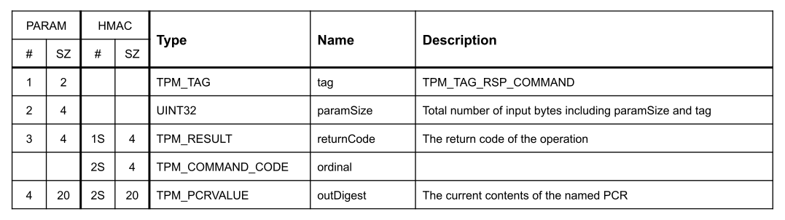

Implementation
++++++++++++++
With the accumulated knowledge about other systems and the resulting decision to
utilize OpenBSD's boot chain, a prototype was developed to meet the following
requirements:

1. The prototype must extend the Chain of Trust across all software components
   involved in the boot process. Specifically, this includes the MBR,
   ``biosboot(8)``, and ``boot(8)``. This fulfills the first part of the title
   of this work: *a measured boot environment.*

2. The prototype leverages this Chain of Trust to enable users to detect
   manipulations of the measured software components. This feature fulfills the
   second part of the title, *including AEM.*

3. The required code should be designed to integrate into OpenBSD. This implies
   it must be released under the BSD license and must not, under any
   circumstances, remove existing functionality.

The order of the requirements corresponds to the structure of the implementation
chapter. It begins with the extension of the startup program in the MBR to
ensure it propagates the Chain of Trust and concludes with the necessary
modifications to ``boot(8)`` for detecting EMAs.

MBR enhancements
================
The source code for the startup program in the MBR is located in the directory
``sys/arch/amd64/stand/mbr/``. It consists of the Makefile, required for
building, and the assembler file ``mbr.S``. Compiling is straightforward:
navigate to the directory and execute the ``make`` command. Once completed, the
file mbr, containing the machine code of the MBR, is generated in the same
directory.

In addition to the actual startup program, which occupies 440 bytes, the MBR
also contains the partition table and the signature ``0x55 0xAA`` at its very
end. The source code includes not only the startup program but also placeholders
for the partition table and signature. Consequently, the assembler generates a
complete MBR with an empty partition table, which can later be modified using
tools such as ``fdisk``. The output file ``mbr`` is exactly 512 bytes in size.
To ensure the partition table remains intact during updates, only the first 440
bytes should be overwritten.

The limited space in the MBR leaves little room for extensive communication with
the TPM. Recognizing this constraint, the Trusted Computing Group (TCG) has
defined an API specifically for such scenarios. This API consists of several
functions, of which only two are sufficient for our use case.

TCG BIOS API
------------
The ``TCG_StatusCheck`` function is used first to verify whether the firmware
provides a TCG-BIOS interface. This function is invoked using the assembly
instruction ``int 0x1A``. Before the call, the CPU must be prepared in the state
shown in :numref:`tcg-status-check-api`.

.. code-block::
   :caption: TCG Status check API [34]_
   :linenos:
   :name: tcg-status-check-api

    # On entry:
        %ah = 0xbb
        %al = 0x00

    # On return:
        %eax = Return code. Set to 00000000h if the system supports the TCG BIOS calls.
        %ebx = 0x41504354
        %ecx = Version and errata of the specification this BIOS supports.
               Bits 7-0 (CL): 0x02 (TCG BIOS Minor Version (02h for version 1.21))
               Bits 15-8 (CH): 0x01 (TCG BIOS Major Version (01h for version 1.21))
        %edx = BIOS TCG Feature Flags (None currently defined. MUST be set to 0)
        %esi = Absolute pointer to the beginning of the event log.
        %edi = is set to the absolute pointer to the first byte of the last event in the log

Thus, only the ah register needs to be set to the value ``0xBB``, and the al
register to ``0x00``, which can be accomplished with a single movw instruction.

The state after returning from the interrupt is also illustrated in
:numref:`tcg-status-check-api`. For the code in the MBR, the primary concern is
determining whether the firmware provides a TCG-BIOS interface. This can be
verified by checking if the content of the eax register is set to ``0x00``. To
ensure accuracy, the ``ebx`` register should also be checked for the value
``0x41504354``, which corresponds to the ASCII characters ``TCPA``. This
abbreviation stands for Trusted Computing Platform Alliance (TCPA).

If both registers hold the correct values, the BIOS provides the TCG interface,
and we can utilize it in the subsequent program flow. The objective is to
measure the Partition Boot Record (PBR) loaded by the MBR by determining its
SHA-1 hash value and extending a Platform Configuration Register (PCR) with it.
However, a standalone SHA-1 implementation already exceeds the 440-byte limit.
Therefore, the hash computation must be delegated to the firmware.

The function provided by the TCG for this task is named
``TCG_CompactHashLogExtendEvent``. Its lengthy name encapsulates all the tasks
it performs: calculating the ``SHA-1`` hash value of a given memory region,
extending the log, and updating a PCR with the computed hash value. This
function is particularly well-suited for space-constrained applications like the
MBR, where only the code for parameter placement and the interrupt invocation is
required.

.. code-block::
   :caption: TCG Compact Hash Log Extend API [34]_
   :linenos:
   :name: tcg-hash-log-extend

    On entry:
        %ah = 0xbb
        %al = 0x07
        %es = Segment portion of the pointer to the start of the data buffer to be hashed
        %di = Offset portion of the pointer to the start of the data buffer to be hashed
        %esi = The informative value to be placed into the event field
        %ebx = 0x41504354
        %ecx = The length, in bytes, of the buffer referenced by ES:DI
        %edx = The PCR number (PCRIndex) to which the hashed result is to be extended

    On return:
        %eax = Return Code as defined in Return Codes 10.2
        %edx = Event number of the event that was logged

:numref:`tcg-hash-log-extend` shows the prerequisites for invoking the
``TCG_CompactHashLogExtendEvent`` function, which is selected by setting the
value ``0xbb07`` in the ``eax`` register. The segment-offset address of the
memory region to be used is expected in the ``es`` and ``si`` registers, while
its size is specified in the ecx register. The ``ebx`` register contains the
ASCII string ``TCPA`` to protect against unintended invocations, edx holds the
index of the PCR register to be used, and esi contains an informational value
for the log. In this implementation, the esi value is consistently set to ``0``
for both calls and is not further utilized.

With these two functions provided by the TCG BIOS API, it is possible to extend
the Chain of Trust. Before invoking the ``TCG_CompactHashLogExtendEvent``
function, it is crucial to understand the exact memory location where the PBR
(Partition Boot Record) is loaded and where the control transfer to it occurs.

OpenBSD MBR
-----------
The MBR startup program scans the partition table for a partition marked as
active, loads the PBR (i.e., the first sector of the partition), and transfers
control to it. Figure 5.3 illustrates the OpenBSD MBR startup program divided
into several sections, with their functions described individually below.

All address and size information is derived from the disassembly of the MBR. An
annotated version of this disassembly (``mbr/mbr.orig.disass``) is included with
this work on the USB stick. The disassembly was generated using the command:

.. code-block:: bash
   :caption: MBR object dump command [65]_
   :linenos:
   :name: mbr-object-dump-cmd

    ./objdump -D -b binary -mi386 -Maddr16,data16

.. figure:: ./_static/mbr_memory.svg
   :name: mbr-layout
   :alt: MBR layout
   :align: center

   MBR layout

``0x000 - 0x022``:
  The code in this section begins by setting various segment registers, which
  prepares the stack for use. Following this, a complete copy of the MBR is made
  from memory address ``0000:7C00`` to ``0000:7A00``, and execution continues
  from this copied location. The reason for this is historical: partition tables
  were added to the MBR at a later stage. If the PBR contains an older MBR, it
  is expected that the firmware will place it at the address ``0000:7C00``.

``0x022 - 0x048``:
  This section contains the logic for enforcing CHS (Cylinder-Head-Sector)
  addressing. CHS is one of two methods for addressing a block on the hard disk,
  the other being LBA (Logical Block Addressing). Without any keyboard input, the
  bootloader checks later whether LBA is supported and, if so, uses it for disk
  access. However, by holding down the Shift key during the boot process, CHS
  addressing can be enforced.

``0x048 - 0x063``:
  This section is further divided into two areas, highlighted in different colors.
  The white section contains instructions that search the partition table in the
  MBR for a partition marked as active. The red section is only reached if no
  active partition is found; otherwise, it is skipped. The red section contains an
  infinite loop and serves as a termination state for the program. In the event of
  an error, this part is also jumped to by later blocks in the program.

``0x063 - 0x0B2``:
  Using the console output function of the BIOS API, the MBR communicates which
  active partition it is attempting to start. Subsequently, it evaluates whether
  the BIOS supports LBA addressing. If LBA is supported, no jump occurs, and the
  light gray block is executed.

``0x0B2 - 0x0E8``:
  In this section, the Partition Boot Record (PBR) is loaded to the address
  ``0000:7C00`` using one of two possible methods. The light gray portion
  contains the code for LBA (Logical Block Addressing), while the dark gray
  portion is responsible for CHS (Cylinder-Head-Sector) addressing.

``0x0E8 - 0x105``:
  In the source code file, this block is labeled as booting_os. Initially, a
  line break is output to the console. Following this, the signature of the
  loaded PBR is verified. If the signature is valid, control is transferred to
  the PBR.

``0x105 - 0x11D``:
  This section contains the ``Lmessage`` and ``Lchr`` functions, responsible for
  outputting text to the BIOS console. ``Lmessage`` expects a pointer to a
  C-style string and passes each character, one at a time, via the ``al``
  register to the ``Lchr`` function for display.

``0x11D - 0x193``:
 This relatively large section contains a placeholder for an LBA command packet
 and the C-style strings for all messages output by the bootloader.

``0x193 - 0x1B8``:
  This 37-byte section is unused and is filled with ``0x00`` by the assembler.

To incorporate the measurement functionality into the MBR start program, we have
precisely 37 bytes of unused space available without removing existing code.
However, a minimal program invoking ``TCG_StatusCheck`` and
``TCG_CompactHashLogExtendEvent`` requires at least 63 bytes under optimal
conditions. This number is based on a small test program that calls both
functions with an arbitrary memory address. Consequently, it is not feasible to
extend the MBR start program with measurement functionality without removing
existing code.

MBR Changes
-----------
The developers of TrustedGRUB2 encountered a similar space constraint and
resolved it by removing the code responsible for loading via CHS
(Cylinder-Head-Sector addressing). However, this solution has the drawback of
rendering the system unbootable on platforms that lack LBA (Logical Block
Addressing) support. Given that parts of the code need to be removed regardless,
it is reasonable to consider removing either the CHS or LBA code. This approach
ensures that the system can still boot, provided the platform supports the
retained addressing method.

By removing the CHS code, an additional 25 bytes of space is freed. Combined
with the existing 37 bytes, this results in a total of 62 bytes of available
memory, which is still insufficient. However, further optimizations can be
applied to the measurement code, such as simplifying the comparison of the full
content of the ebx register. These adjustments can reduce the code size
sufficiently to fit within the 62 bytes of available space.

.. code-block:: asm
   :caption: Optional CHS for MBR
   :linenos:
   :name: mbr-optional-chs

    do_chs:
    #ifdef NO_CHS
        movw $enochs, %si
        jmp err_stop
    #else
        movb $CHAR_CHS_READ, %al
        call Lchr
        # ...
        int $0x13
        jnc booting_os

    read_error:
        movw $eread, %si
        jmp err_stop
    #endif

    booting_os:
        # ...

In this context, "removal" refers to optionally excluding the CHS code through a
preprocessor directive. :numref:`mbr-optional-chs` highlights the newly added
source code lines in green. Instead of outright eliminating the CHS code path,
it is replaced with a smaller segment of code. This replacement displays the
error message *Compiled w/o CHS* and subsequently halts the system. This
approach at least lets users on CHS only system know what the problem is.

The space allocated for the string in ``enochs`` is only slightly larger than
that in ``eread``. Since it is used exclusively for CHS read errors, it can also
be removed when the CHS code path is excluded during compilation. As a result,
the total memory required for the strings remains almost unchanged.

With the newly available memory, the code for measuring the PBR can be added.
Figure :numref:`mbr-measure-code` illustrates the complete assembly instructions
required for this functionality.

.. code-block:: asm
   :caption: MBR measure code
   :linenos:
   :name: mbr-measure-code

    do_lba:
        # ...
        jnc tpm_measure
    tpm_measure:
    #ifdef TPM_MEASURE
        pushl %edx

        movw $0xbb00, %ax
        int $0x1a
        test %eax, %eax
        jnz measure_end
        cmpw $0x4354, %bx
        jnz measure_end

        movw $0xbb07, %ax
        xorw %di, %di
        xorl %esi, %esi
        movl $0x41504354, %ebx
        movl $0x200, %ecx
        xorl %edx, %edx
        movb $0x08, %dl
        int $0x1a

    measure_end:
        popl %edx
    # endif

    booting_os:
        puts(crlf)
        # ...

For orientation, both the code above and below the newly inserted section are
shown. Referring again to Figure :numref:`mbr-layout`, the insertion is located
precisely at address ``0x0e8``, directly after loading the PBR and before
handing control over to it.

Line 6:
  The pushl instruction is the first newly added command. It saves the content
  of the ``edx`` register onto the stack. This register contains the disk number
  passed by the BIOS, indicating the disk from which the BIOS loaded the MBR.
  Since the ``TCG_StatusCheck`` call overwrites the contents of this register
  with the TPM feature flags, the disk number is restored after the measurement
  code is completed using the ``pop`` instruction in line 25.

Lines 8-13:
  These lines show the code for invoking the ``TCG_StatusCheck`` function. After
  the interrupt in line 9, the return values are evaluated. First, it ensures
  that the ``eax`` register contains the value 0. Then, ``bx`` is compared to
  ``TC``. To save space, only the first two bytes of the ebx register (which
  would otherwise contain the full ``TCPA`` value) are checked. If both
  registers contain the correct values, the measurement process continues.

Lines 15-22:
  These instructions execute the ``TCG_CompactHashLogExtendEvent`` function.
  Initially, all required parameters are loaded into CPU registers. The
  segment-offset is stored in the ``di`` register, which is reset to 0 using an ``xor``
  instruction. The extra-segment register es is already correctly set and points
  to the segment of the PBR. Its fixed size of 512 bytes (``0x200``) is written into
  the ``ecx`` register in line 20. To save a byte, the PCR index is not directly
  written into ``edx`` with a ``movl`` instruction; instead, the register is first reset
  to 0 using ``xor``, and then the least significant byte (LSB) is set with a movb
  instruction (lines 21-22). The TCPA protection value is stored in ebx, and the
  event log entry is set to 0 in esi. This prepares the interrupt in line 23 to
  be triggered.

If the modified MBR is compiled with the command:

.. code-block:: bash

    make CPPFLAGS+=-DNO_CHS CPPFLAGS+=-DTPM_MEASURE

and the resulting binary is written over the existing bootloader using ``dd``,
the PBR will be measured into ``PCR-08``. The patch file
``mbr/measure_biosboot.patch``, which includes all changes made to ``mbr.S``, is
provided on the USB stick accompanying this work.

The MBR now extends the Chain of Trust up to the PBR, which, in the case of
OpenBSD, contains the biosboot(8) binary. This binary shares several
similarities with the MBR in its functionality. The next chapter outlines the
necessary modifications required to further extend the Chain of Trust from
``biosboot(8)`` to ``boot(8)``.

PBR enhancements
================
The PBR contains the ``biosboot(8)`` binary, whose source code resides in the
directory ``sys/arch/amd64/stand/biosboot``. This includes the assembler file
``biosboot.S``, the Makefile, the linker script ``ld.script``, and the manual
page ``biosboot.8``. Similar to the MBR, the biosboot program can be compiled by
simply running the ``make`` command in the same directory.

The process produces the Executable and Linkable Format (ELF) file ``biosboot``,
which, in addition to the actual machine code, also contains metadata about the
program. This metadata is used to directly set variables within the machine code
during installation. This procedure was described in the foundational concepts
in :ref:`biosboot(8)`.

With the included metadata, the file is significantly larger than the available
512 bytes. Therefore, during installation, the installboot(8) utility extracts
the text segment and writes it to the first block of the partition. Since the
PBR does not require a partition table, the full 512 bytes—minus the 2 signature
bytes at the end—are available for the machine code. The distribution of these
510 bytes is detailed in this following chapter.

OpenBSD biosboot
----------------
As with the modifications to the MBR boot program, we will analyze the structure
of ``biosboot(8)``, assess the remaining available memory for extensions, and
identify code that could be removed without affecting the loading of the
second-stage bootloader, ``boot(8)``.

The text segment of the ELF file can be extracted using the command:

.. code-block:: bash
   :caption: PBR objcopy command
   :linenos:
   :name: pbr-object-copy-cmd

    ./objcopy -O binary --only-section=.text biosboot biosboot.text

Subsequently, the disassembly can be generated with the same method as used for
the MBR in :numref:`mbr-object-dump-cmd`. The disassembled code is included on
the accompanying USB stick in the file ``pbr/biosboot.bin.disass``.

   PBR layout

``0x000 - 0x03E``
  The PBR starts with the BIOS Parameter Block (BPB) and the extended BPB, which
  contain information about the filesystem of the partition. It begins with the
  ASCII string ``OpenBSD`` at offset 0x03 and ends with the string ``UFS 4.4``,
  making it easily identifiable in a hex dump.

``0x03E - 0x063``
  At the start, the processor is initialized, preparing the stack and data
  segment. If CHS is enforced via a set flag or by holding the Shift key, the
  message !Loading is displayed on the console. If LBA is available, the leading
  exclamation mark is omitted from the output.

``0x063 - 0x0C6``
  In the first part of this section, the program checks whether the firmware
  supports LBA. If it does not, the program requires more detailed information
  about the disk geometry, which it obtains via a BIOS call in the second part
  of this section. Once all the necessary information is available, the block
  containing the inode data structure of ``boot(8)`` is loaded into memory.

``0x0C6 - 0x103``
  In this section, a loop is used to load all the blocks that ``boot(8)`` spans
  into memory. Whether CHS or LBA is used no longer matters, as a function
  pointer variable has already been set to either do_lba or do_chs. This
  function pointer is invoked repeatedly until ``boot(8)`` is completely loaded
  into the system memory.

``0x103 - 0x135``
  In the white section, the signature of the loaded program is verified. For
  ``boot(8)``, because it is an ELF file, the signature contains the characters
  ``ELF`` at the beginning. If the signature is invalid, execution continues in
  the red section, which outputs an error message and then halts the system. If
  the signature is valid, the green section is executed, where control is handed
  over to ``boot(8)``.

``0x135 - 0x1d1``
  This section contains a total of five functions. The light gray block at the
  beginning is the ``do_chs`` function, which can load a block from the disk
  using CHS. The small dark gray block is the ``do_lba`` function, which also
  loads a block from the disk but uses LBA instead. The following dark blue area
  represents the ``fsbtosector`` function, which converts a filesystem block
  address into a sector address. The subsequent light blue section contains the
  ``Lmessage`` and ``Lchr`` functions, which are already known from the MBR.

``0x1d1 - 0x200``
  The section concludes with variables and strings (in the brown area), similar
  to the MBR, followed by 8 bytes of unused space in black.

PBR Changes
-----------
The necessary adjustments are very similar to those made in the MBR. We use the
exact same TCG-BIOS API shown in subsection :ref:`TCG BIOS API` to verify
whether the interface is offered by the firmware, and if so, employ the same
function to extend the Chain of Trust.

In the PBR, we have the full 512 bytes available for the program, but as shown
in :numref:`pbr-layout`, only 8 bytes are unused. This means that, as before, we
will make the CHS code path optional using a preprocessor directive, thereby
freeing up sufficient space for the extension.

The invocation of the ``TCG_StatusCheck`` function is identical to that in the
MBR. The only difference is that here, we have enough space to compare the full
contents of the ebx register with TCPA. The call is located directly at address
0x126, in the green block in :numref:`pbr-layout`, immediately before control is
handed over to ``boot(8)``.

.. code-block:: nasm
   :caption: Size and Address of Boot
   :linenos:
   :name: size-and-addr-of-boot

    movl inodedbl, %esi
    movl -32(%esi), %ecx

    movw $(LOADADDR >> 4), %bx 5
    movw %bx, %es

In the MBR, the size of the PBR, with its 512 bytes, was already known in
advance. For ``boot(8)``, however, this is not the case, and its size must be
determined at runtime. This is achieved through lines 1 and 2 of
:numref:`size-and-addr-of-boot`. According to the source code comments, the
memory at the inodedbl address contains a pointer to the Direct Block List of
the inode data structure for ``boot(8)``. Its format is described in the file
``sys/ufs/ufs/dinode.h``, and we see that the 64-bit byte size information is
located exactly 32 bytes before the Direct Block List (``di_db``).

Since we have sufficient memory available, we explicitly set the ``es``
register, even though it has already been set to the correct value by previous
code. The es register can only be set to the value of another register.
Therefore, an intermediate step with the ``bx`` register is necessary, into
which we write the segment address of ``boot(8)``.

If we now compile ``biosboot(8)`` with the changes, which are also included as a
patch file on the USB stick under ``pbr/measure_boot.patch``, and install the
result using the installboot tool, ``boot(8)`` will be measured in ``PCR-09``.
The Chain of Trust is now extended all the way to the software component that
asks users for the Full Disk Encryption (FDE) password. This fulfills
requirement 1, which is to maintain the Chain of Trust across all software
components involved in the boot process.

boot(8) Enhancements
====================
This chapter explains the changes made to ``boot(8)`` to enable the detection of
manipulations to the MBR, PBR, or ``boot(8)`` itself.

The source code for ``boot(8)`` is not located in a single directory like the
MBR or ``biosboot(8)``, but is spread across several directories. The Makefile
for building boot(8) can be found in the folder ``sys/arch/amd64/stand/boot/``.
It lists all the source files involved. The reason for this distribution is
that, for the first time, platform-independent C code is included.

``sys/arch/amd64/stand/boot (2)``
  Contains the amd64 platform-specific code for boot(8). This includes the
  Makefile and the srt0.S assembly file.

``sys/stand/boot (4)``
  This directory contains the platform-independent code of the bootloader, such
  as the boot shell.

``sys/arch/amd64/stand/libsa (13)``
  Contains amd64-specific code, such as bootloader commands that are only
  available on a specific platform or the Global Interrupt Descriptor Table
  (GIDT).

``sys/stand/libsa (44)``
  This directory contains source code for fundamental and platform-independent
  functions such as ``alloc``, ``memcpy, or ``strtol``.

``sys/lib/libkern (4)``
  Contains mathematical functions for data types that are larger than the
  natively supported types of the platform, such as 128-bit types on 64-bit
  platforms.

``sys/lib/libz (4)``
  Contains code for decompressing files and checksum algorithms like CRC and
  Adler.

Since this work only considers the ``amd64`` platform, only the third directory,
``sys/arch/amd64/stand/libsa``, is relevant. It contains the platform-specific
commands for the bootloader. Here, we can add a TPM command that provides all
the desired functionalities. To keep the source code file with the
machine-specific commands organized, we will offload the TPM code into its own
file.

We have already successfully used the TCG-BIOS-API when extending the Chain of
Trust. Since there is also no driver infrastructure in place for ``boot(8)``, it
would be sensible to use the API here as well. In the following sections, we
will clarify whether the API provides all the functions we need and whether
these can be called from ``boot(8)``.

PasstroughToTPM
---------------
The ``TCG_PassthroughToTPM`` function allows any command to be sent to the TPM.
It offers great flexibility at the cost of abstraction. This function takes two
memory areas as arguments: one containing the serialized TPM command and another
where the TPM's response will be written. Callers receive no assistance in
creating the TPM command, but any command can be sent to the TPM. The memory
areas are passed to the function through the registers shown in
:numref:`tcg-passthroughtotpm-machine-state`.

.. code-block:: none
   :caption: TCG_PassthroughToTPM Machine State [34]_
   :linenos:
   :name: tcg-passthroughtotpm-machine-state

    On entry:
        %ah = 0xbb
        %al = 0x02
        %es = Segment portion of the pointer to the TPM input parameter block
        %di = Offset portion of the pointer to the TPM input parameter block
        %ds = Segment portion of the pointer to the TPM output parameter block
        %si = Offset portion of the pointer to the TPM output parameter block
        %ebx = 0x41504354
        %ecx = 0
        %edx = 0

    On return:
        %eax = Return Code as defined in Section 13.3 (Return Codes)
        %ds:%si = Referenced buffer updated to provide return results.

The segment-offset pair ``es``, ``di`` does not point directly to a TPM command
but rather to an Input Parameter Block. At the end of this block follows the
actual TPM command data. Before these, there is a small header containing
information for the BIOS, as illustrated in :numref:`input-parameter-block`.

   Input Parameter Block

``IPBLength``
  is the length of the Input Parameter Block. This includes the 8 bytes of the
  header as well as the number of bytes of the TPM command, i.e.,
  ``TPMOperandIn``.

``OPBLength``
  contains the length of the Output Parameter Block and must be greater than 4
  bytes, as the header alone requires this amount.

``TPMOperandIn``
  contains the data of the serialized TPM command.

The byte order of the header fields, both in the Output Parameter Block and the
Input Parameter Block, matches the system's endianness and therefore does not
require further consideration.

Using the ``TCG_PassThroughToTPM`` function, we can utilize all TPM
functionalities. The only remaining requirement is the code necessary to make a
BIOS call from ``boot(8)``.

BIOS calls from boot(8)
-----------------------
In contrast to the MBR and PBR, both of which largely left the CPU unchanged,
``boot(8)`` introduces its own Global Interrupt Descriptor Table (GIDT). This
extends the one set by the BIOS and transitions the CPU from Real Mode to
Protected Mode. As described in the fundamentals in :ref:`Basic Input Output
System`, the BIOS service routines stored in the GIDT assume that the processor
is operating in Real Mode.

To call BIOS services from ``boot(8)``, special logic is required to transition
the processor into Real Mode before invoking the BIOS function and then back
into Protected Mode afterward. To automate this process for the programmer, a
new interrupt vector is initialized for all BIOS-defined interrupt vectors,
offset by 32 (``0x20``).

This can be explained with an example: for the interrupt vector ``0x1a``, which
we use, ``boot(8)`` initializes the interrupt vector ``0x3a`` with a handler.
This handler reverts the CPU to the state expected by the BIOS. Then, the actual
interrupt is called using vector 0x1a (calculated as 0x3a - Offset), and upon
return, the CPU is restored to its previous state.

The return values from BIOS calls can be handled in two different ways:

1. Leaving the content unchanged in the CPU registers: This approach has the
   drawback that since ``boot(8)`` is primarily written in C, the compiler must
   be informed which registers are modified by a BIOS call. Without this, there
   is a risk that the compiler may store a variable in a register, which could
   then be inadvertently altered during the BIOS call.

2. Providing the return values in memory while leaving the CPU registers
   unchanged: This method avoids the risk of unintended register modification
   and is generally safer for integration with C code.

.. code-block:: none
   :caption: BIOS API bug
   :linenos:
   :name: bios-api-bug

    /* clear NT flag in eflags */
    /* Martin Fredriksson <martin@gbg.netman.se> */
    pushf
    pop %eax
    and $0xffffbfff, %eax
    push %eax
    popf

    /* save registers into save area */
    movl %eax, _C_LABEL(BIOS_regs)+BIOSR_AX
    movl %ecx, _C_LABEL(BIOS_regs)+BIOSR_CX
    /* ... */

Technically, OpenBSD supports both approaches. The return values are available
both in the CPU registers and in memory within the ``BIOS_regs`` structure. In
OpenBSD 6.5, however, there is a bug in transferring the return values, as shown
in :numref:`bios-api-bug`. These assembly instructions execute after the BIOS
interrupt. At the bottom, you can see how the register contents are saved into
the ``BIOS_regs`` structure.

In the upper part, the content of ``eax`` is overwritten with the CPU flags, and
this value ends up in ``BIOS_regs.biosr_ax``. This issue was reported and has
been fixed in newer versions of OpenBSD. For the remainder of this work, the
patch ``boot/gidt.patch`` (found on the USB stick) was used, ensuring that all
return values in BIOS_regs are correct.

At this point, it should also be noted that both the es and ds registers are set
to the values in ``BIOS_regs`` before switching to Real Mode. If you want to
pass these values, it must be done by assigning them to the
``BIOS_regs.biosr_es`` or ``BIOS_regs.biosr_ds`` fields.

After resolving the error, we can now perform a BIOS call and read the return
values. So far, this has only been done directly from assembly code. However,
``boot(8)`` is mostly written in C, and our TPM code will also be written in C.
The GNU Compiler Collection (GCC) compiler allows for incorporating assembly
instructions into C code using the ``__asm`` statement. [51]_ (chap. 6.47)

.. code-block:: none
   :caption: Inline Assembler Syntax
   :linenos:
   :name: inline-assembler-syntax

     asm asm-qualifiers ( AssemblerTemplate
           : OutputOperands
         [ : InputOperands
         [ : Clobbers ] ])

``asm asm-qualifiers``
  :numref:`inline-assembler-syntax` illustrates the general syntax for inline
  assembly. It begins with the keyword ``asm``, which can vary between
  compilers, followed by asm-qualifiers such as ``volatile``, ``inline``, or
  ``goto``. For example, goto specifies that a jump to a label may occur within
  the assembly code. [51]_ (chap. 6.47).

``AssemblerTemplate``
  is a standard C-string containing assembly instructions. Multiple individual
  instructions are separated by a newline and a tab character. However,
  differences may occur depending on the assembler being used. [51]_ (chap.
  6.47)

``OutputOperands``, ``InputOperands``
  inform the compiler which C variables are required as input for the assembly
  code and into which variables the output should be written. This work makes
  limited use of this feature, so the explanation is kept brief. For more
  detailed information, the book "Using the GNU Compiler Collection" [51]_
  (chap. 6.47) can be consulted.

``Clobbers``
  is a list of registers that are not listed in OutputOperands or InputOperands
  but whose contents might still be altered during the execution of the machine
  code. The compiler requires this information to avoid storing function
  variables in such registers, where they might unintentionally be modified.

.. code-block:: C
   :caption: Inline Assembly Example
   :linenos:
   :name: inline-assembly-example

    __asm volatile("movl $0xBB00, %%eax\n\t"
                   "int $0x20 + (0x1A)\n\t"
        :
        :
        : "%eax", "%ecx", "%edx", "%ebx", "cc");
    if(BIOS_regs.biosr_ax == 0x00 &&
        BIOS_regs.biosr_bx == 0x41504354) {
        /* API is supported */

:numref:`inline-assembly-example` illustrates the invocation of the
``TCG_StatusCheck`` function using inline assembly. The assembly instructions are
straightforward and require no additional explanation. This example is for
demonstration purposes only, for the final result of this work the ``DOINT``
macro provided by OpenBSD was used.

This macro automatically adds the offset of 32 (``0x20``), eliminating the need
to specify it directly. As shown in :numref:`tcg-status-check-api`, many
register contents are overwritten during the function call. This is specified to
the C compiler through the ``Clobbers`` parameter, while the ``InputOperands``
and ``OutputOperands`` are left empty. This is because the ``BIOS_regs``
structure is used to retrieve the return values.

The if statement leverages the ``BIOS_regs`` structure to determine whether the
TCG BIOS API is available.

With the inline assembly feature, we can now invoke the TCG_PassThroughToTPM
function from C code and send arbitrary commands to the TPM. Next, we will
explore how these commands and their corresponding responses are structured.

TPM Commands
------------
For all TPM commands, the bit order of all multi-byte data types follows Big
Endian format, meaning the Most Significant Byte (MSB) is placed first. This
aligns with the Internet standard. Since the Intel CPU in the test system uses
Little Endian format, the bytes must be swapped during serialization. [31]_
(chap. 2.1.1)

Based on the so-called ``TPM_TAG``, all commands can be categorized into three
classes [31]_ (chap. 6). There are commands that do not require authorization,
such as the ``TPM_PCRRead`` command, which allows reading the content of a PCR.
Then, there are commands that require a single authorization, like ``TPM_Seal``,
and commands like ``TPM_Unseal``, which require two authorizations.

All the example commands are called from the final prototype. The structure for
both authorized and unauthorized commands will be explained below. More commands
were needed for the implementation, but since they follow the same pattern,
further explanation is unnecessary. For additional details on other commands,
refer to the specification [32]_.

PCR Read Command
~~~~~~~~~~~~~~~~
The ``TPM_PCRRead`` command allows reading the contents of a PCR. The serialized
data for the request is shown in :numref:`tpm-pcr-read-rq`, which is from the third part of
the TPM specification [32]_. It includes the definition of the request, the
response, and possibly general notes about the command.

   TPM PCR Read Request [32]_ (chap. 16.2)

The figure shows the parameter number in the first column. If the field is
empty, it means the parameter is only used for the authorization calculation and
is not part of the message. The second column, labeled **SZ**,indicates the size
of the parameter in bytes. The information under **HMAC** is required for the
authorization calculation. Since ``TPM_PCRRead`` does not require this, it will
be discussed in the next section.

The fields **Type**, **Name**, and **Description** are self-explanatory.
However, it is important to note that if the type is not a basic one like
``UINT32``, its structure is described in detail in the second part of the
specification [31]_.

``tag``
  The value specified for the tag parameter, ``TPM_TAG_RQU_COMMAND``, indicates
  two things: first, the exact value to be assigned, which is ``0xc1``, and
  second, that this is a request without authorization.

``paramSize``
  The ``tag`` parameter is followed by the ``paramSize`` parameter, whose value
  for this request is ``14``, representing the sum of all entries in the SZ
  column.

``ordinal``
  The ordinal serves as the identifier for the command to be executed. For the
  ``TPM_PCRRead`` request, this is the constant ``TPM_ORD_PCRRead``, which has
  the value ``0x15``.

``pcrIndex``
  Finally, the ``pcrIndex`` parameter specifies the desired index as a
  ``UINT32``.

When these values are sent in the correct order and with the appropriate
byte-endianness, the TPM responds in the format shown in
:numref:`tpm-pcr-read-rsp`.

   TPM PCR Read Response [32]_ (chap. 16.2)

The first three parameters in the response are similar to those in the request,
with the difference that instead of an ``ordinal``, there is a ``returnCode``.
This parameter contains the value 0 if the request was successful. Otherwise, it
includes an error code, whose meaning can be found in the specification [31]_
(chap. 16).

``outDigest``
  The value of the requested PCR is located in the outDigest field at the end.

These 20 bytes can now be displayed. This completes the explanation of the basic
structure of commands without authorization.

Seal Command
~~~~~~~~~~~~
Reading a PCR requires no authorization, making the command relatively
straightforward. In contrast, ``TPM_Seal`` requires a key, for which
authorization is necessary.

Before delving into the two different protocols for authorization sessions, it
is essential to understand the term "entity" in the TPM context. An entity is
anything referenced by a handle in relation to the TPM [29]_ (chap. 8). Examples
include a key, such as the SRK (referenced by the handle ``TPM_KH_SRK``), as
well as an NVRAM index or PCRs. For this work, an entity refers either to the
SRK or a sealed blob, although the latter is not referenced by a handle in our
case.

To interact with an entity, the first step is to initiate an authorization
session. This can be done using either the **Object Independent Authorization
Protocol (OIAP)** or the **Object Specific Authorization Protocol (OSAP)**. The
key difference between the two is that an OSAP session is valid for a single
entity, whereas an OIAP session can be used for multiple entities. Due to its
lower overhead, an OIAP session is generally preferred. However, commands that
involve transmitting authorization data specifically require an OSAP session
[30]_ (chap. 13.1).

Both protocols initiate a session through a single TPM command, involving an
initial exchange of nonces. Both the client and the TPM must retain the nonce
sent by the other party. The specification refers to a nonce generated by the
client as a "**Nonce-Odd**" and one generated by the TPM as a "**Nonce-Even**".
These nonces are always used for the next request or response, integrated into
the authorization process via a hash function. To maintain this chain, a new
nonce is transmitted with every subsequent request or response. These rolling
nonces help protect against replay attacks [30]_ (chap. 13.1).

:numref:`tpm-seal-rq` illustrates the structure of a ``TPM_Seal`` request. The
authorization-specific data is located below the double line. With the
Nonce-Even and the Auth-Handle—obtained from the response to an OSAP request —
we have all the necessary information to construct the request.

   TPM Seal Request [32]_ (chap. 10.1)

Except for the ``encAuth`` parameter, all fields above the double line—which
separates the authorization data from other parameters—are straightforward to
populate. In this work, the ``keyHandle`` is always set to the SRK. The
``pcrInfo`` is a simple structure that allows multiple PCRs to be selected using
bitfields, and the ``data`` parameter is entirely flexible, provided it does not
exceed the maximum size of 255 bytes.

The ``encAuth`` parameter contains the 20-byte authorization data in encrypted
form. Demonstrating knowledge of this data is required during the unsealing
process. Since this feature is not needed for this work, the Well-Known-Secret
(20 bytes zeroed out) was used. Consequently, the somewhat complex process of
determining the encrypted version is not further explained here.

``authHandle``
  Below the double line, the authorization data begins with the ``authHandle``.
  For this request, it must be the handle of an OSAP session, as specified in
  the description. The value for this handle is provided by the TPM in the
  response to the OSAP request.

``authLastNonceEven``
  In this request, we encounter for the first time a parameter not transmitted
  but derived from a previous TPM response. This is evident from the empty
  parameter field number of the ``authLastNonceEven`` parameter in Figure 5.16.
  Thus, we proceed with the serialization of the command starting from the
  ``nonceOdd`` parameter while incorporating the previously received
  ``nonceEven`` into a hash value, the calculation of which will be explained
  later.

``nonceOdd``
  The ``nonceOdd`` is a randomly generated number by us, which we retain until
  receiving the response to verify the authorization data.

``continueAuth``
  The ``continueAuth`` parameter controls whether the authorization session
  remains valid after this command or is no longer needed. However, since the
  ``TPM_Seal`` command transfers a new authorization secret via ``encAuth``,
  this value is ignored, and the session is terminated [30]_ (chap. 13.1).

``pubAuth``
  As the description indicates, the value in the pubAuth field is an HMAC, where
  the UsageAuth of the specified key is used as the secret for its calculation.
  Since only the SRK (Storage Root Key) is used in the prototype, and we
  specified the ``--srk-well-known`` option when initializing the TPM with the
  ``tpm_takeownership`` command, the UsageAuth of the SRK is 20 null bytes.

To calculate the HMAC, we first need the parameter digest intermediate value,
which will be referred to as **P**. This value is the result of a SHA1 hash
calculation applied to the concatenation of all the parameters listed in the
HMAC column. For ``TPM_Seal``, this would include the following parameters:

.. math::

   P = SHA1(S1 | S2 | S3 | S4 | S5 | S6)

This intermediate value then becomes part of the HMAC calculation, with the
result being assigned to the pubAuth field. The HMAC algorithm combines the
parameter digest P with the UsageAuth of the key

.. math::

   pubAuth = HMAC_{usageAuth}(P | 2H1 | 3H1 | 4H1)

This concludes the overview of the structure of TPM commands, giving us a basic
understanding of their composition. All other commands follow the same schema
and thus only need to be implemented accordingly. As more commands are
integrated into OpenBSD, a suitable architecture becomes increasingly important
to ensure that the software is easily extendable and programming errors are
avoided. This is discussed in the next section.

Software Architecture
=====================
We begin this section with the cross-cutting concern of memory management. The
aim is to implement it in a way that minimizes memory leaks and reduces the
number of necessary data copies wherever possible.

These requirements shaped the ``tpm_buffer`` structure and its associated
functions, which are designed to return a specific memory segment from the
buffer.

.. code-block:: C
   :caption: Memory Management API
   :linenos:
   :name: memory-management-api

    enum TPM_BUFTYPE {
        TPM_BUFTYPE_REQUEST,
        TPM_BUFTYPE_RESPONSE
    };

    struct tpm_buffer
    {
        enum TPM_BUFTYPE type;
        unsigned char* data;
    };

    struct tpm_header*
    get_tpm_header(struct tpm_buffer* buf);

    void*
    get_tpm_payload(struct tpm_buffer* buf);

    struct tpm_request_authorization*
    get_tpm_request_auth1(struct tpm_buffer* buf);

Request and response are each stored in their own ``tpm_buffer``, as
authorization calculations require data from the request, and the
``TCG_PassThroughToTPM`` function returns an error if the same memory region is
used for both the request and the response.

The pointer ``tpm_buffer.data`` points to a memory region large enough to
accommodate any TPM command. This is ensured by the constant ``TPM_MAX``, which
is set to a value of ``4096``.

The top layer of the architecture allocates two tpm_buffer structures once and
releases them before returning. All underlying layers operate within these two
memory regions, avoiding the need for additional memory allocation. This design
satisfies both requirements: only the top layer manages memory allocation and
deallocation, and all data—from the Input/Output Parameter Block to the TPM
command—is sequentially stored in memory.

:numref:`mm-buffer-layout` illustrates all memory regions with dedicated
functions for access, ensuring structured and efficient handling of memory
operations.

   Memory Management Buffer Layout

Layers
------
As illustrated in :numref:`sw-arch-layers`, the source code can be divided into
three layers from a software architecture perspective:

   OpenBSD AEM Layers

**driver layer**
  At the lowest level lies the **driver layer**, which contains two functions
  implemented using inline assembly. These functions serve as the C interface to
  the TPM, acting as the bridge between the software and the hardware. They are
  dedicated solely to this purpose and have no additional responsibilities.

**command layer**
  Directly above the driver layer is the command layer, comprising seven
  functions, each dedicated to handling **exactly one specific TPM command**.
  For example, the ``tpm_seal`` function does not initiate an authorization
  session itself. Instead, it takes the authorization handle as a parameter and
  focuses solely on constructing and sending the ``TPM_Seal`` command.

**application layer**
  At the highest level is the application layer, where multiple commands are
  executed sequentially to implement a function, such as sealing. This layer is
  responsible for the allocation and deallocation of memory, which is then
  utilized across all underlying layers.

The error-handling principle is straightforward: If an error occurs, regardless
of the layer, an error message describing the issue is immediately output, and
the function returns a universal error constant. Consequently, all functions
have an ``int`` return type, while other results are passed back via pointer
parameters.

This concludes the explanation of the TPM-specific part of the OpenBSD AEM
software architecture. The remaining source code, which primarily handles the
persistent storage of the sealed secret on a storage medium, is so minimal that
it resides directly within the command functions and therefore does not require
a separate software architecture.

boot(8) ``tpm`` Command
=======================
The previously shown functions from the application layer now need to be made
accessible to users. This is accomplished through the newly added,
machine-specific command ``machine tpm``, whose inputs, in case of an valid
number of parameters, look as follows:

.. code-block:: none
   :caption: boot(8) machine tpm command
   :linenos:
   :name: boot-machine-tpm-command

   boot> machine tpm
   machine tpm r[andom]|p[cr]|u[nseal] [DiskNumber]|s[eal] secret [DiskNumber]
   boot>

The four possible operations are separated by the logical OR operator ``|``. All
optional inputs are indicated by square brackets. Only one operation can be
executed per call.

**random**
  It outputs a random number generated by the TPM to the terminal

**pcr**
  It outputs the contents of the first 15 PCRs to the terminal

**unseal**
  It loads exactly one block starting from offset 1 (just after the MBR) from
  the disk with number ``0x80`` (can be overridden by the DiskNumber parameter)
  and checks if it starts with the ``AEMS`` signature. If so, the 4-byte length
  of the subsequent sealed secret follows immediately after the signature. The
  command passes these two values to the TPM API and, upon success, displays the
  **decrypted** secret in text form on the terminal.

**seal**
  Takes the secret as a parameter and optionally the disk number. The secret is
  sealed using the TPM with PCRs 04, 08, and 09. ``PCR-04`` measures the MBR,
  ``PCR-08`` measures the PBR, and ``PCR-09`` contains the measurement of
  ``boot(8)``.

  If the sealing is successful, the block for persistent storage is prepared. It
  begins with the ``AEMS`` signature, followed by the 4-byte length information
  and the encrypted data. This block is then written to the disk at offset 1,
  directly after the MBR.

The storage in the disk block directly after the MBR is only performed because
it is easy to implement. In a dual-boot system with Grub, a part of the Grub
kernel resides in this block. This will be overwritten by OpenBSD-AEM without
any prompt. Therefore, it should be emphasized again that the result of this
work is a prototype and by no means a finished software product. In OpenBSD 6.5
with a standard installation using Full Disk Encryption (FDE), this block is
empty, so the prototype can be used without any issues.

.. [29] Will Arthur, David Challener, Kenneth Goldman A Practical Guide to TPM
   2.0, 01/2015

.. [30] TPM Main Part 1 Design Principles, 03/2011 Version 1.2

.. [31] TPM Main Part 2 TPM Structures, 03/2011 Version 1.2

.. [32] TPM Main Part 3 Commands, 03/2011 Version 1.2

.. [34] TCG PC Client Specific Implementation Specification for Conventional
   BIOS, 02/2012 Specification Version 1.21 Errata

.. [51] Richard M. Stallman and the GCC Developer Community Using the GNU
   Compiler Collection, 10/2003

.. [65] https://prefetch.net/blog/index.php/2006/09/09/digging-through-the-mbr/
