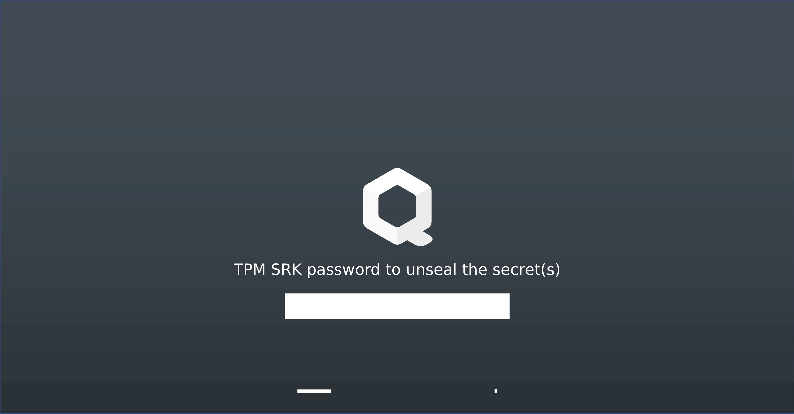
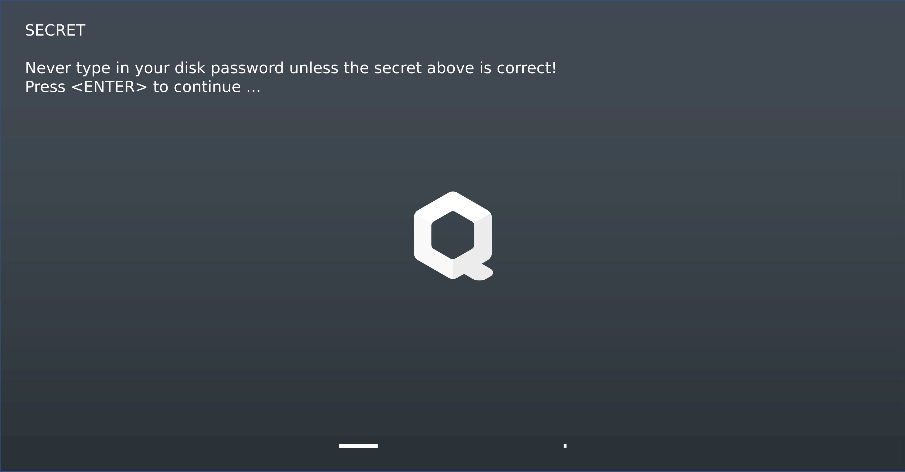

State of the Art Analysis
+++++++++++++++++++++++++
This chapter analyzes the systems set up in the appendices. The analysis
examines their technical functionality and evaluates their complexity, features,
and user-friendliness.

TrustedGRUB2 presents several compelling reasons for inclusion in this analysis.
First, its source code is publicly available, offering a much deeper insight
into its technical functionality compared to closed-source alternatives such as
the Windows Bootloader. Second, GRUB, and by extension TrustedGRUB2, supports
BIOS-based booting. While other open-source alternatives like systemd-boot and
Clover also exist, they require UEFI-based booting. Lastly, TrustedGRUB2
supports measured boot processes, a feature that is rare among open-source
bootloaders and the primary reason why alternatives like Syslinux were not
considered.

QubesOS with the AEM extension is also well-suited for analysis for several
reasons. The extension offers a highly configurable solution for detecting Evil
Maid (EM) attacks, providing various options for boot media and flexible forms
for secrets. In addition to its extensive configuration capabilities, the
extension is open-source. While Windows BitLocker also supports a range of
configurations, its closed-source nature makes it less suitable for an in-depth
analysis. Finally, the comprehensive documentation of the AEM extension stands
out as a major advantage. Beyond installation instructions, it includes detailed
information about potential attack vectors and recommended countermeasures.

The combination of both solutions is logical, as they employ different
approaches to establishing the Root of Trust for Measurement. TrustedGRUB2
utilizes a Static Root of Trust for Measurement (SRTM), while the AEM extension
for QubesOS employs a Dynamic Root of Trust for Measurement (DRTM). Furthermore,
they diverge in their methods for creating the initramfs. QubesOS leverages the
dracut tool, whereas the Arch Linux system with TrustedGRUB2 uses mkinitcpio.
Gaining an understanding of both approaches positively impacts the overall
outcome, as it enables selecting the most suitable method. However, the criteria
for comparison still need to be defined.

This analysis aims to provide a comprehensive understanding of existing
solutions. Knowledge of available features serves as a guideline for designing a
custom approach. Insights into the functionality of individual solutions can be
utilized to evaluate the feasibility of a combined solution using existing
components. If such an integration proves impractical, the understanding of the
underlying technologies can form the foundation for developing a new solution.

TrustedGRUB2
============
Appendix B details the setup of an Arch Linux system with TrustedGRUB2. The
following section provides an in-depth analysis of this system.

In general, TrustedGRUB2 can be characterized as outdated and poorly maintained.
The last commit to the TrustedGRUB2 repository (``e656aaa``) occurred on June 8,
2017. Since that time, 294 commits have been added to the upstream GRUB
repository (see Section :numref:`grub-commit-count`). The date of the last
commit, combined with the significant divergence from the upstream GRUB 2
codebase, suggests that the project has been abandoned.

.. _Technical details of TrustedGRUB2:

Technical details
-----------------
In a system using traditional GRUB, the chain of trust terminates after the
Master Boot Record (MBR), as the MBR lacks support for the Trusted Platform
Module (TPM). TrustedGRUB2, a fork of GRUB version 2.02, extends the chain of
trust to include the operating

   Trusted GRUB 2 Chain

The final component measured by the firmware is the Master Boot Record (MBR). In
a system using GRUB, the MBR loads the first sector of the GRUB kernel
(diskboot.img) and then transfers control to it. To enable measurement of this
loaded sector while keeping its size under 512 bytes, the CHS
(Cylinder-Head-Sector) code was removed. PCR-08 is extended with the SHA-1 hash
of diskboot.img, after which the boot process continues [2]_ (chap. 11) [42]_.

diskboot.img loads the remaining sectors of the GRUB kernel (core.img) and
extends PCR-09. This kernel is capable of interpreting various file systems, and
further measurements depend on the configuration file grub.cfg located on the
hard drive [2]_ (chap. 11) [42]_.

The modular structure of GRUB allows for the loading of code at runtime. These
so-called modules must, of course, also be measured. TrustedGRUB2 extends GRUB
so that each module is measured into PCR-13 during the loading process.

All commands contained in the grub.cfg file are interpreted by a shell, which is
also used in the command line accessible to users in the GRUB menu. With the
extensions of TrustedGRUB2, every command executed from the shell is measured
into PCR-11. The configuration file is located in the unencrypted boot
partition, and its contents is shown in :numref:`tgrub-boot-contents`.

   Trusted GRUB 2 boot partition contents

With the loaded configuration file ``boot.cfg``, GRUB is ready to load the
operating system kernel. To ensure that the kernel is also measured, the
commands ``linux`` and ``initrd`` were modified by TrustedGRUB. The ``linux``
command loads a Linux kernel from the hard drive and passes all subsequent
parameters to it. The ``initrd`` command can only be executed after the
``linux`` command and is responsible for loading the initramfs from the hard
drive [2]_ (chap. 16.3.37, chap. 16.3.33). Afterward, the kernel is started with
the initramfs, completing the process, and TrustedGRUB2 no longer retains
control over the system.

The image :numref:`tgrub-boot-contents` displays the output of the tree command
in the unencrypted boot directory. Most of the files in this directory are
measured by TrustedGRUB2 and have already been discussed in detail.

The file ``grubenv``, which has not been previously mentioned, is used by
the bootloader to retain information across reboots. The commands
``load_env`` and ``save_env`` allow the GRUB environment to be loaded
from or saved to this file. To prevent this process from introducing a security
vulnerability, the loading of this file must either be disabled or the file must
be measured using the ``measure`` command provided by TrustedGRUB2
[2]_ (chap. 15.2) [42]_.

The ``locale`` directory in this system is empty, though it typically
contains information for the use of GRUB in various regions. If the environment
variable ``locale_dir`` is not set, internationalization is disabled,
rendering the files in this directory irrelevant. If internationalization is
desired, the ``measure`` command can be used to measure the locale files
for added security [2]_ (chap. 15.1.19).

The handling of theme files is similar to that of internationalization files.
They are not automatically measured by TrustedGRUB2. Consequently, their
integrity must be ensured using the ``measure`` command, as themes cannot
be entirely disabled. It is worth emphasizing that exploiting a security
vulnerability in GRUB would be necessary to inject unmeasured malicious code via
theme or locale files.

The technical architecture of the system has been comprehensively analyzed,
detailing the data stored unencrypted on the disk, the programs that assume
control of the system, and the specific contents recorded in the PCRs. The
subsequent section transitions into a critical evaluation, beginning with an
analysis of system complexity.

Complexity
----------
A preliminary indicator of the complexity of a software feature can be the total
lines of code it comprises. The modifications introduced by TrustedGRUB2 are
clearly delineated in the source code with start and end markers. This allows
the augmented code to be extracted using the command illustrated in
:numref:`trusted-grub-extension`. The total lines of code added amount to 3,297,
which can feasibly be reviewed within a single workday. The majority of this
code consists of the Secure Hash Algorithm (SHA)-1 implementation and
functionality for unsealing a key file used in Full Disk Encryption (FDE) with
Linux Unified Key Setup (LUKS).

Given that the firmware source code is not publicly available, it is only
possible to make limited assertions regarding the extent of its modifications.
The BIOS provides three TPM functions to facilitate communication with the TPM.
Furthermore, the firmware is responsible for measuring every software component
to which it transfers control of the system.

Grub itself is significantly more complex, as demonstrated by the output of the
cloc command shown in :numref:`trusted-grub-cloc`. The large number of lines of
code corresponds to the extensive set of features provided by Grub. Support for
themes, modules, and internationalization—each loaded from the disk across a
variety of file systems—complicates the task of making definitive statements
regarding whether all files have been properly measured.

The same applies to BIOS firmware, which can be extended through so-called
Option ROMs. An Option ROM is firmware that resides, for instance, on a PCI
expansion card and is executed by the BIOS after the POST (Power-On Self-Test)
process [46]_ (chap. 4-12).

In summary, the SRTM concept is straightforward in theory, but its secure
implementation in practice is complicated by a flexible and modular boot
process. However, even if the Chain of Trust does not cover everything, the
difficulty of executing a successful attack increases with each measured
component.

Functionality
-------------
To utilize TrustedGRUB2, the platform must meet the following criteria: the
processor architecture must be either i386 or amd64, and the firmware must be a
traditional BIOS or UEFI with CSM enabled. Additionally, a TPM is required
within the system. If these prerequisites are fulfilled, TrustedGRUB2 and its
provided functionalities can be employed [42]_.

TrustedGRUB2 establishes a foundation for runtime reporting by measuring system
components during startup. This process enables functionalities such as granting
access to corporate networks exclusively to authorized clients. The Chain of
Trust constructed by TrustedGRUB2 reduces the likelihood of returning PCR values
that do not correspond to the executed software, thereby enhancing the integrity
of the verification process.

A particularly relevant feature for this work is the ability to decrypt a
keyfile for an encrypted LUKS volume during startup through TPM unsealing. GRUB
supports LUKS volumes and can decrypt them using the cryptomount command.
TrustedGRUB2 extends this functionality by enabling the keyfile to be decrypted
through TPM unsealing prior to use. This ensures that decryption, and
consequently the system boot, can only proceed if the measured components remain
unaltered. To enhance security, an SRK (Storage Root Key) should be set,
ensuring that decryption cannot occur without the owner's consent.

Usability
---------
TrustedGRUB2 is not included in the official package repositories of Arch Linux,
Ubuntu, or Fedora (as outlined in :numref:`trusted-grub-availability`).
Consequently, utilizing this bootloader requires downloading the source code
along with all dependencies and manually compiling it. This process is
cumbersome and represents the first significant drawback in terms of
user-friendliness.

Due to the abandoned state of the repository, it is necessary to apply several
patches from upstream GRUB to enable compilation on a current system. This step
merely brings the code to a compilable state without incorporating bug fixes or
newly introduced features from upstream GRUB. For individuals without experience
in software development, this requirement can be considered a significant
barrier to using TrustedGRUB2.

A positive aspect worth highlighting is the transparent manner in which the
bootloader was extended. Users already familiar with GRUB will intuitively
understand how to work with TrustedGRUB2. The installation process is identical,
and there are no differences in the configuration file used for booting a Linux
kernel. Additionally, the newly introduced commands, such as ``measure`` and
``readpcr``, are both practical and straightforward to use via the GRUB command
line.

Unfortunately, a seal command for initially encrypting a keyfile is not
available, and attempts to execute the ``measure`` command were unsuccessful.
During testing, the command consistently failed with the error message:
``TCG_HashLogExtendEvent failed: 0x10001``.

The poor user-friendliness of TrustedGRUB2 makes a compositional solution
unfeasible, as the effort required to bring this project up to date would be
excessively high. However, its technical implementation is well-designed and can
serve as an inspiration for developing a custom implementation.

.. code-block:: bash
   :caption: Source: Grub repository commit count
   :linenos:
   :name: grub-commit-count

    $ git clone https://github.com/rhboot/grub2.git; cd grub2
    $ git log --since 1.6.2017 --oneline --no-merges | wc -l
      294

.. code-block:: bash
   :caption: Source: TrustedGRUB2 extension
   :linenos:
   :name: trusted-grub-extension

    $ rg -il ')/\* BEGIN TCG EXTENSION \*/' | xargs sed -En \
             '/\/\* begin tcg extension \*\//I,/\/\* end tcg extension \*\//Ip'

.. code-block:: bash
   :caption: Source: TrustedGRUB size
   :linenos:
   :name: trusted-grub-cloc

    $ cd /TrustedGRUB2
    $ cloc **/*.c **/*.h
        1316 text files.
        1301 unique files.
          20 files ignored.

    github.com/AlDanial/cloc v 1.84  T=2.28 s (571.3 files/s, 163019.2 lines/s)
    -------------------------------------------------------------------------
    Language               files          blank        comment           code
    -------------------------------------------------------------------------
    C                        827          40065          32101         234678
    C/C++ Header             474           8128          15644          40589
    -------------------------------------------------------------------------
    SUM:                    1301          48193          47745         275267
    -------------------------------------------------------------------------
    $

.. code-block:: bash
   :caption: Source: TrustedGRUB availability
   :linenos:
   :name: trusted-grub-availability

    $ # Fedora 31
    $ dnf search trusted grub
    Last expiration check: 0:03:51 ago on Fri 13 Dec 2019 05:37:18 AM EST
    No matches found

    $ # Ubuntu 19.10
    $ apt-cache search trusted grub
    $

Qubes AEM
=========

This chapter examines QubesOS and its *qubes-anti-evil-maid* extension.
:ref:`Appendix A` provides a detailed description of the setup process for this
system. The analysis, similar to that of the other test system, explores the
technical architecture and evaluates its functionality, complexity, and
user-friendliness.

.. _Technical Details QubesAEM:

Technical details
-----------------

Similar to the TrustedGRUB2-based system, the disk is partitioned utilizing the
partition table located in the Master Boot Record (MBR). As demonstrated by the
``fdisk`` and ``lsblk`` outputs in :numref:`qubes-aem-partitions`, the disk was
segmented during installation into an unencrypted boot partition and a
LUKS-encrypted partition. While the partitioning methodologies are consistent
across both systems, significant differences arise in the implementation of
their respective Roots of Trust for Measurement (RTM).

Qubes-AEM employs a Dynamic Root of Trust for Measurement (DRTM). However,
during the boot process, a Static Root of Trust for Measurement (SRTM) chain is
also initiated, which terminates at the Grub bootloader. Consequently, the upper
portion of :numref:`qubes-chain` is identical to that presented in the
TrustedGRUB2 analysis in the :ref:`Technical details of TrustedGRUB2`.

   Qubes AEM boot chain

In this configuration, Grub does not directly boot the Linux kernel but instead
loads the open-source software tboot to enable a measured and verified operating
system start using Intel Trusted Execution Technology (Intel TXT) [43]_. tboot
prepares specific memory regions in accordance with the requirements of the
GETSEC[SENTER] processor instruction and subsequently executes it.

The CPU microcode then initiates the processor preparation process. The
Initiating Local Processor (ILP) sends a synchronization signal to all other
cores and waits for their ready signal. Subsequently, the ILP loads the SINIT
Authenticated Code Module (ACM) and verifies its signature. If the signature is
valid and originates from Intel, the SINIT ACM is executed [38]_ (chap. 1.2.1).

Before the **Measured Launch Environment** (MLE)—in this case, again tboot—gains
control of the system, ``PCR-17`` and ``PCR-18`` are reset and then extended.
Intel categorizes the contents of PCRs into Details and Authorities. The actual
hash value of an entity, such as the SINIT Authenticated Code Module (ACM), is
classified as a Detail and extends ``PCR-17``, while the hash value of the
public key used to verify the signature is categorized as an Authority, thereby
extending ``PCR-18``.

If rollbacks do not present a security vulnerability, this separation allows a
secret to be sealed with ``PCR-18`` and later unsealed, even after the
underlying code has been updated. A detailed list of which entities contribute
measurements to ``PCR-17`` and ``PCR-18``,, in addition to the SINIT ACM and the
MLE (tboot), can be found in the MLE Software Guide [38]_ (chap. 1.10.2).

.. TODO: ref

The Measured Launch Environment (MLE), represented by tboot, assumes
responsibility for continuing the Chain of Trust. It extends the Platform
Configuration Registers (PCRs) as follows: ``PCR-17`` is extended with the tboot
policy and the tboot policy control value. ``PCR-18`` is extended with the hash
value of tboot itself and the first module specified in the grub.cfg
configuration file. In this instance, this module is the Xen Hypervisor. The
grub.cfg file, as shown in Listing A.6, specifies the Xen Hypervisor along with
additional modules. The hash values of these modules are sequentially appended
to ``PCR-19`` in the order they are listed in the configuration file [43]_.

   Qubes AEM boot contents

Once control of the system is handed over to the Xen Hypervisor, the Measured
Launch process for tboot is considered complete. However, Qubes-AEM extends
beyond merely providing a measured launch with Dynamic Root of Trust for
Measurement (DRTM). It also offers a comprehensive solution designed to detect
and mitigate Evil Maid (EM) attacks.

:numref:`qubes-boot` illustrates the contents of the unencrypted boot partition.
For clarity and to conserve space, the components of the grub2 directory that
were previously displayed :numref:`tgrub-boot-contents` have been omitted.

While this system contains significantly more files than the one using
TrustedGRUB2, the number of relevant files is comparable. The grayed-out files
can be safely deleted without altering measurement values or affecting the boot
process. Files highlighted in purple are informational only, typically
containing symbols or copies of configuration files used during the compilation
of the kernel or the hypervisor.

In addition to the Linux kernel and its associated initramfs, which were also
present in the TrustedGRUB2 system, the Qubes-AEM setup includes the hypervisor,
tboot, and the SINIT ACM. These components, integral to the system's
functionality, have been discussed in detail earlier.

The remaining files in the aem directory are created during the initial boot of
Qubes OS with the AEM extension enabled. To fully understand their contents and
purpose, it is necessary to first examine the functionality of the AEM extension
in detail.

   Qubes AEM Login Post

During the first boot after installing the AEM software, the process deviates
from a standard boot sequence. Initially, as in a regular setup, the user enters
the password to decrypt the hard drive. Following this, the first major
distinction becomes evident. Qubes-AEM begins the sealing process for the
defined secrets, binding them to the contents of PCR 13, 17, 18, and 19.

``PCR 13`` is extended by Qubes-AEM with the LUKS header of the encrypted
partition, while the remaining PCR contents have already been discussed. Beyond
the user-created file ``secret.txt``, Qubes-AEM attempts to seal additional
items:

1. Shared secret for a Time-Based One-Time Password Algorithm (T-OTP): ``secret.otp``.

2. Keyfile for Full Disk Encryption (FDE): ``secret.key``.

3. Freshness Token: ``secret.fre``.

These elements will be examined in detail in Section 3.2.3, which focuses on
functionality. With the initial sealing process complete, the integrity of the
system can be verified during subsequent boots, even before entering the FDE
password.

   Qubes AEM Login SRK

Immediately after startup, the system prompts for the SRK password. This step
prevents unauthorized individuals from accessing the secret and using it to set
up a compromised system. Such a manipulated system could, irrespective of the
software being executed, display the secret without discrepancy. As a result,
the victim would be unable to discern whether the system has been tampered with,
thereby compromising the confidentiality of the FDE password.

Qubes-AEM also allows configuring a USB stick as a boot medium. In such a setup,
the use of an SRK password becomes optional, offering a trade-off between
usability and security. However, a TPM with an active SRK password provides an
additional layer of protection and is therefore inherently more secure than a
TPM without one. Following the password entry (if required), the unsealing
process is initiated, and the secret is displayed.

   Qubes AEM Login secret

:numref:`qubes-login-secret` illustrates the Qubes-OS login screen presented
after entering the SRK password. It displays the secret specified during
installation, labeled **SECRET**, alongside a prompt advising that the FDE
password should only be entered if the secret is verified as correct. Since the
secret is known exclusively to the user, it can only be displayed if the TPM
permits unsealing. This process occurs solely when the PCR values match those
recorded during the sealing process. Maintaining these values requires the
measured components, such as the Linux kernel or the hypervisor, to remain
unaltered.

This demonstrates the concept of a platform-state-bound secret and underscores
the critical role of safeguarding the secret in maintaining security. Without
proper confidentiality of the secret, the system's security is fundamentally
compromised.

With this foundational understanding, we now turn to a more detailed examination
of the technical implementation of Qubes-AEM. To achieve this, we first analyze
the environment that is active at the time of login.

Before the actual root filesystem is mounted, the Linux kernel operates using
the initramfs as its root filesystem. The initramfs is a Gzip-compressed Copy
In, Copy Out (CPIO) archive containing only the programs and modules necessary
for the kernel to mount the actual (encrypted) root filesystem [47]. The
construction of this archive varies across different Linux distributions. Under
Qubes OS, the tool dracut is employed for this purpose.

Qubes-AEM leverages dracut's configuration options to incorporate specific
scripts and programs into the initramfs, ensuring that the required
functionality for its integrity verification processes is included [48]_.

Qubes-AEM is implemented entirely through configuration files and sh or bash
scripts. Consequently, it has numerous dependencies, including a complete TPM
software stack, the tpm-tools, three small utilities developed specifically for
Qubes OS, and various standard Linux utilities such as file and grep [48]_
(module-setup.sh).

These scripts operate in two distinct environments: the initramfs and the
decrypted root filesystem. They manage interactions with the TPM and the
Plymouth login screen, enabling users to detect potential Evil Maid Attacks
(EMAs) effectively.

This chapter has covered a wide range of topics, starting with a system
leveraging a Dynamic Root of Trust for Measurement (DRTM), followed by the Chain
of Trust established by Qubes OS with the AEM extension, and concluding with the
initramfs phase of a Linux system and the technical specifics of the Qubes-AEM
software.

Complexity
----------

For a meaningful comparison, we begin by examining the size of the software
components. At the start of the Chain of Trust, the SINIT ACM module is
executed. Since its source code is not publicly available, it is not possible to
provide an assessment of its size. Following this, tboot is executed, with its
line count as determined by cloc shown in :numref:`tboot-scope`. This reveals
that tboot alone comprises over 20,000 lines of C/C++ code. In contrast, the
size of Qubes-AEM is significantly smaller, consisting of approximately 900
lines of script code (see :numref:`qubes-aem-scope`).

Dynamic Root of Trust for Measurement (DRTM) offers the advantage of a shorter
Chain of Trust compared to a comparable system using Static Root of Trust for
Measurement (SRTM). A shorter chain is generally easier to comprehend and less
complex. However, this simplicity comes with the drawback that the platform must
be trusted to a greater extent than with SRTM.

For example, DRTM introduces resettable Platform Configuration Registers (PCRs).
This operation requires a specific privilege level, referred to as Locality,
which is controlled by the platform. If there are vulnerabilities in the
implementation, the locality may be spoofed, potentially allowing the
modification of PCR contents.

Shell scripts are widely understood by developers and system administrators, as
they are commonly used to automate workflows. Combined with their relatively
small size, this makes them the component with the lowest complexity in the
system. However, these scripts include features that increase complexity without
necessarily enhancing security.

One such example is the capability to boot multiple Qubes-OS devices from a
single USB stick. While this functionality adds flexibility, it does not
contribute directly to the system's security posture.

DRTM reduces the Chain of Trust at the cost of increasing the overall system
complexity. The CPU must meet specific requirements, making the solution
ultimately tied to a particular platform. While both AMD and Intel offer these
extensions, tboot currently supports only Intel. The numerous features and the
DRTM approach contribute to a relatively high level of complexity.

Functionality
-------------
To leverage the full functionality of Qubes-AEM, the system must meet all
prerequisites specified for the TrustedGRUB2 system. Additionally, the processor
must be an Intel model equipped with the Intel Trusted Execution Technology
(TXT) extension. Once these requirements are satisfied, the software can operate
with its complete feature set, delivering its intended capabilities [43]_ [44]_.

Qubes-AEM leverages Intel TXT to establish a Chain of Trust with a dynamic root.
The resulting PCR values can be utilized at runtime to verify that the system
was booted with a specific configuration. QubesOS enables this functionality by
providing a complete TPM software stack for runtime queries, ensuring seamless
interaction and verification.

The Qubes-AEM extension utilizes PCR values to detect software manipulations.
The fundamental mechanism was discussed in :ref:`Technical Details QubesAEM`,
where the focus was on a configuration without an external boot medium and with
an SRK password set. Qubes-AEM provides several configuration options, which are
detailed in the following sections.

In addition to the internal boot medium, a USB stick or an SD card can be used
as an external medium. In this configuration, the bootloader and all unencrypted
data reside on the external medium, which, due to its small size, can be easily
secured. In its simplest use case, the external medium serves the same purpose
as the SRK password in an internal installation—protecting the secret. An
attacker would need simultaneous physical access to both the PC and the boot
medium to access the secret [44]_.

To safeguard the confidentiality of the password and secret against video
surveillance or shoulder surfing, Qubes-AEM offers multifactor authentication.
During the creation of the external boot medium, a shared secret is generated
and can be imported into an app like "Authy," "Google Authenticator," or
"FreeOTP" either via a barcode or manual input. Instead of displaying a static
secret during login, a one-time password (OTP) is shown as a six-digit number,
which must match the number displayed in the app.

To avoid entering the FDE password, Qubes-AEM generates a keyfile that can also
decrypt the full disk encryption (FDE). This keyfile is secured with a separate,
unique password. After entering the required information, the system boots,
ensuring that even if someone records the input and output during the startup
process, they gain no knowledge of either the secret or the FDE password.

The Freshness Token, briefly mentioned during the examination of the boot
partition contents, plays a critical role in the system's security mechanism.
Essentially, it consists of 20 bytes of random data that, like the secret, are
sealed by the TPM. Upon successful system authentication, the hash of the
Freshness Token is stored in the Non-Volatile Random Access Memory (NVRAM) of
the TPM.

During the next boot, the system verifies whether the token's hash matches the
value stored in the NVRAM and displays an alert if there is a mismatch. After
successful authentication, a new Freshness Token is generated for subsequent
boots. This mechanism ensures that attackers with access to a copy of the
external boot medium must start the laptop before the rightful owner has a
chance to do so. Otherwise, the Freshness Token is regenerated, invalidating the
old one.

This feature provides protection for the shared secret used in the Time-Based
One-Time Password (T-OTP) system. If an invalid Freshness Token is detected,
Qubes-AEM halts the process, safeguarding the system against unauthorized
access. In the event that a boot medium is lost, Freshness Tokens can also be
manually invalidated [61]_.

A unique ID stored in the NVRAM of the TPM enables the use of a single USB stick
as an external boot medium for multiple QubesOS instances. However, to achieve
the highest level of security, it is recommended to use a separate boot medium
for each device. Furthermore, these media should be stored securely and
separately to minimize the risk of unauthorized access or compromise.

Usability
---------
As with most software aiming for the highest level of security,
user-friendliness is not a strong point. This challenge begins with the QubesOS
operating system itself, which is not compatible with all hardware
configurations. During the course of this work, attempts to run QubesOS on a
Dell XPS 15 9550 and a ThinkPad T410 were unsuccessful, despite both devices
being listed in the Hardware Compatibility List (HCL) and having been
successfully tested with older versions of QubesOS by other users.

The AEM extension also has its weaknesses in terms of user-friendliness. While
the installation of the required components is relatively straightforward,
setting up a system with AEM protection is complex. It involves several
non-sequential steps, and certain technical details, such as manually
downloading the correct SINIT ACM, must be addressed independently. For a
successful installation, the accompanying README file must be meticulously
followed step by step. Even with strict adherence, there is still a risk that
the system may not function correctly due to unforeseen issues or subtle
configuration errors.

The first error encountered during this work was that the GRUB configuration
file did not set the SINIT ACM as a module after installation. Although this
issue was fixed in the repository back in September 2017, a new version with the
fix did not appear in the package repositories until February 12, 2018 [45]_.
Without the SINIT ACM set as a module, the Chain of Trust cannot be established,
rendering Qubes-AEM nonfunctional.

Another issue with lesser impact is the invalid token in the barcode when using
multifactor authentication. The URL embedded in the barcode contains a line
break at the end, which is the reason why importing it into "Authy" fails.

In addition to the two previously mentioned issues, the operating system with an
AEM configuration only starts after an additional setting for the hypervisor has
been made in the grub.cfg file. The tboot README [43]_ contains an example
configuration where this setting is applied. Therefore, it is likely that the
configuration created by Qubes-AEM is faulty.

A positive aspect is the seamless integration into the login process. Once the
system is correctly set up, no further intervention is required. Before the text
box for entering the FDE password appears, Qubes-AEM displays the secret.

.. code-block::
   :caption: Source: Qubes AEM Partitions
   :linenos:
   :name: qubes-aem-partitions

    $ fdisk -l /dev/sda
    Disk /dev/sda: 476.96 GiB, 512110190592 bytes, 1000215216 sectors
    Disk model: SAMSUNG MZ7TE512
    Units: sectors of 1 * 512 = 512 bytes
    Sector size (logical/physical): 512 bytes / 512 bytes
    I/O size (minimum/optimal): 512 bytes / 512 bytes
    Disklabel type: dos
    Disk identifier: 0xa8b6ae5b

    Device     Boot   Start        End   Sectors  Size Id Type
    /dev/sda1  *       2048    2099199   2097152    1G 83 Linux
    /dev/sda2       2099200 1000214527 998115328  476G 83 Linux

    $ lsblk -f /dev/sda
    NAME   FSTYPE      LABEL UUID
    sda
      sda1 ext4        aem   ccc1704b-607b-4417-b60e-c3bba2e0224d
      sda2 crypto_LUKS       e2e988a9-c19b-4af8-b9b5-5d4efd6beef6

.. code-block::
   :caption: Source: tboot scope
   :linenos:
   :name: tboot-scope

    $ cd /tboot-1.9.10/tboot
    $ cloc ./**/*
          89 text files.
          89 unique files.
           1 file ignored.

    github.com/AlDanial/cloc v 1.84  T=0.32 s (273.3 files/s, 103615.1 lines/s)
    --------------------------------------------------------------------------
    Language                files          blank        comment           code
    --------------------------------------------------------------------------
    C                          41           3207           3882          16988
    C/C++ Header               39            946           2185           4691
    Bourne Shell                2             39             54            422
    Assembly                    4            103            276            379
    make                        2             47             39            102
    --------------------------------------------------------------------------
    SUM:                       88           4342           6436          22582
    --------------------------------------------------------------------------
    $

.. code-block::
   :caption: Source: QubesOS AEM scope
   :linenos:
   :name: qubes-aem-scope

    $ cd /qubes-antievilmaid
    $ cloc ./**/*
          23 text files.
          19 unique files.
          14 files ignored.

    github.com/AlDanial/cloc v 1.84  T=0.06 s (150.2 files/s, 30166.4 lines/s)
    --------------------------------------------------------------------------
    Language                files          blank        comment           code
    --------------------------------------------------------------------------
    Bourne Shell                3            135             48            563
    HTML                        1             20              0            518
    Bourne Again Shell          4            120             47            353
    Ruby                        1              0              0              3
    --------------------------------------------------------------------------
    SUM:                        9            275             95           1437
    --------------------------------------------------------------------------
    $

Conclusion
==========
With the completion of the analysis of QubesOS-AEM, two systems with different
approaches now exist, which will be compared in the following.

Both systems use different approaches for the Root of Trust for Measurement.
TrustedGRUB2 utilizes SRTM, which, compared to the DRTM used in Qubes-AEM,
performs better. The following arguments support this statement:

1. The theoretical concept behind SRTM is simpler to understand compared to
   DRTM. In the case of an immutable CRTM, the execution begins, and all
   software components are measured by their predecessor. DRTM, on the other
   hand, involves resettable PCRs and privilege levels (Localities) that are
   enforced by hardware, and to verify these, knowledge of a closed-source Intel
   CPU is required.

2. Specifically for Intel's implementation, DRTM utilizes the SINIT ACM
   (Intel-signed closed-source software). Obtaining this binary alone is
   cumbersome. Furthermore, several security vulnerabilities have already been
   discovered in older versions [49]_, [50]_.

3. The required code for SRTM is significantly smaller than that for DRTM. This
   makes it easier to understand and implement independently.

The features offered by Qubes-AEM are significantly more comprehensive than
those of the TrustedGRUB2 system. While TrustedGRUB2, with a set SRK and a LUKS
keyfile sealed with the TPM, can detect a subset of EM attacks, external storage
devices, multifactor secrets, and DRTM are exclusive to Qubes-AEM and bring the
security up to a different level.

In terms of user-friendliness, both systems perform similarly poorly. The
biggest issue with TrustedGRUB2 is its neglected state, while for Qubes-AEM, the
complex setup process and the errors that occur during a typical installation
are the main challenges.

Qubes-AEM is much better maintained. The pull request submitted for this work
was merged within a day, and since the start of this research, another release
of the extension has been published. In contrast, TrustedGRUB2 has not received
any commits since 2017, and pending pull requests are not being integrated.
Qubes-AEM also benefits from being designed for an operating system where this
feature holds significant importance (with its own TPM entry in the HCL [62]_
and documentation found under Security in the Qubes documentation [63]_), which
ensures that it is well integrated.

This paragraph concludes the state-of-the-art analysis, in which two different
systems with countermeasures against EM attacks were presented and analyzed. The
foundational knowledge gained so far has been supplemented with two practical
implementations. Using this information, different solution approaches will be
presented in the next chapter, one of which will ultimately be implemented.

.. [2] Gordon Matzigkeit Yoshinori K. Okuji Colin Watson Colin D. Bennett, the
   GNU GRUB Manual, 06/2019

.. [38] Intel® Trusted Execution Technology (Intel® TXT), 11/2017 Measured
   Launched Environment Developer’s Guide

.. [42] Trusted GRUB 2 Readme, Zugriff am: 09/2019
   https://github.com/Rohde-Schwarz/TrustedGRUB2/blob/master/README.md

.. [43] tboot Readme, Zugriff am: 12/2019
   https://github.com/tklengyel/tboot/blob/master/README

.. [44] QubesAEM readme, Zugriff am: 01/2020
   https://github.com/QubesOS/qubes-antievilmaid

.. [45] QubesAEM Repository, Zugriff am: 01/2020
   https://github.com/QubesOS/qubes-antievilmaid

.. [46] IBM Personal System/2 and Personal Computer BIOS Interface Technical
   Reference, 04/1987

.. [48] QubesOS - AEM Quellcode, https://github.com/QubesOS/qubes-antievilmaid

.. [49] Rafal Wojtczuk, Joanna Rutkowska, Alexander Tereshkin Another Way to
   Circumvent Intel® Trusted Execution Technology, 12/2009

.. [50] Rafal Wojtczuk, Joanna Rutkowska Attacking Intel TXT®via SINIT code
   execution hijacking, 11/2011

.. [61] Email correspondence with author Patrik Hagara (usbstick)

.. [62] QubesOS HCL, https://www.qubes-os.org/hcl/

.. [63] QubesOS AEM Documentation, https://www.qubes-os.org/doc/anti-evil-maid/
